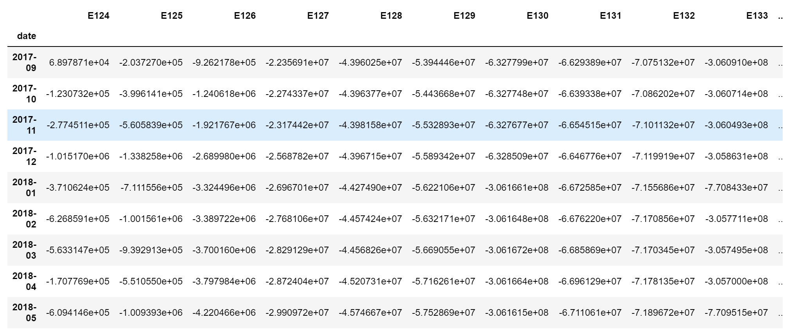
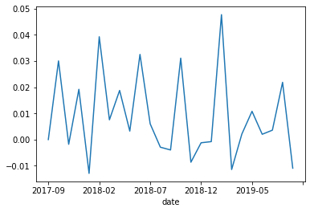
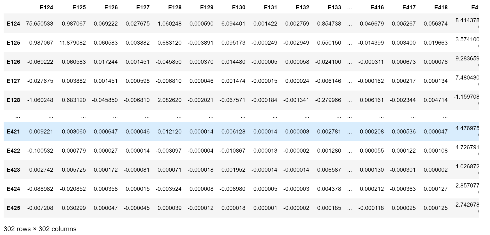
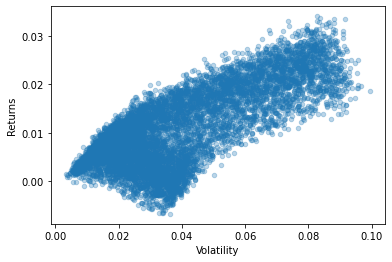
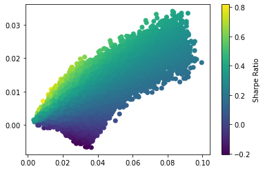
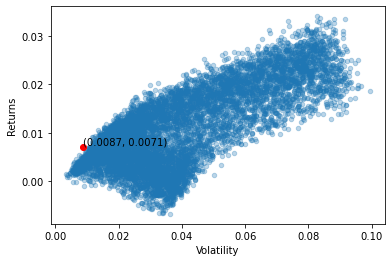
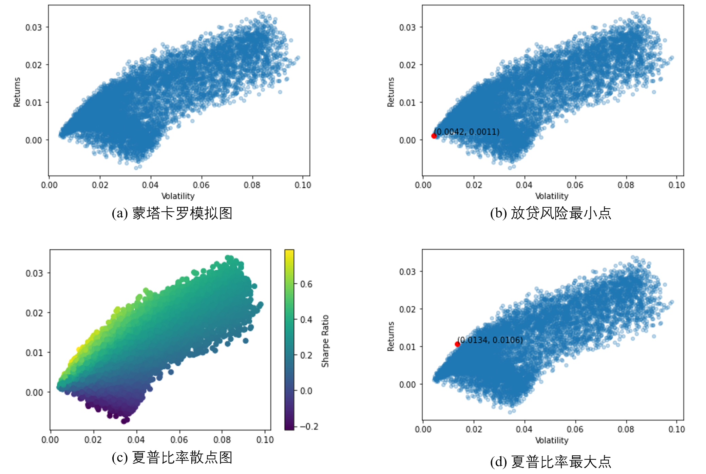
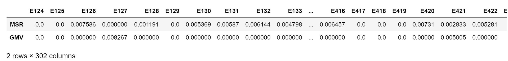

# <center>中小微企业的信贷决策</center>

## <center>摘要</center>

&emsp;本文针对银行对于中小微企业的信贷决策问题，以让银行得到较高的期望收益以及承担较低的风险为目的，并基于蒙特卡洛模拟，马科维茨投资理论，回归统计模型，为银行设计了合理的投资组合，最佳贷款年利率，最优贷款公司组合及其贷款权重的贷款方案。

&emsp;针对问题一，本文将信贷策略分为两个考虑层面：银行的期望收益和所受风险。对于期望收益，我们考虑了贷款年利率、客户违约率、贷款额、信誉评级以及客户流失率这五项因素，并利用频率估计概率，统计线性回归模型，表达式变量代换以及求导操作，得出了银行对于每一家企业的最佳期望收益，并在此基础上求出期望收益的相关系数，与企业信誉情况相结合分析出银行将要承担的风险。最后，我们提出了马科维茨投资组合理论算法，为问题二、问题三年度信贷总额确定时计算最优贷款公司组合及其贷款权重作了铺垫。

&emsp;针对问题二，在问题一的基础上，年度信贷总额被固定为一亿元，在问题一的基础上，我们首先得出每一家企业的最佳期望收益、期望收益的相关系数与协方差矩阵，通过对马科维茨投资组合理论进行多次蒙塔卡罗模拟，得到蒙特卡洛模拟散点图，之后找到最低风险以及最佳夏普率所对应的各个公司的放贷比重，并绘制出相对应的图像进行比较，得出对于附件二各个公司的最佳放贷比重。

&emsp;针对问题三，在问题二的基础上，我们将作废发票视为一种信贷风险，并对其进行概率求取，再与期望收益表达式结合，得出新的期望收益方程，之后重复问题二中用到的方法，得出新的结论并与问题二作比较。除此之外，根据题目中提到的突发因素，本文考虑了新冠疫情和美国限华政策分别对不同企业的影响，并给出了此时银行应作出的策略调整。

&emsp;本文最大的亮点在于：建立的模型充分利用了附录中提供的数据，并综合“期望收益”与“风险分析”考虑了贷款年利率、客户违约率、贷款额、信誉评级、客户流失率、公司财力情况和突发因素等七个方面。

**关键词：** 投资组合优化，蒙特卡洛模拟，马科维兹投资理论，回归统计模型，期望收益，风险分析，夏普比率，协方差，中小微企业，信贷决策

<div style="page-break-after:always;"></div>

## <center>一、问题重述</center>

&emsp;实际生活中，银行以信贷政策、企业的票据信息和上下游企业在业内的影响力为根据对实力强、供求稳定的企业提供贷款服务并根据风险对企业给予利率优惠。银行首先要对企业的实力和风险进行评估，进而依据信贷风险等因素来确定其信贷策略。

&emsp;某银行对确定要放贷企业的贷款额度为10~100万元，年利率为4%~15%；贷款期限为1年。

&emsp;附件1~3给出了123家有信贷记录企业的相关数据、302家无信贷记录企业的相关数据和贷款利率与客户流失率关系的2019年统计数据。现在需要根据实际和附件中的数据信息，通过建立数学模型研究对中小微企业的信贷策略，主要解决以下三个问题：

&emsp;(1) 对附件1中123家企业的信贷风险进行量化分析，并在年度信贷总额固定的情况下，给出该银行对这些企业的信贷策略。

&emsp;(2) 在问题1的基础上，对附件2中302家企业的信贷风险进行量化分析，并在年度信贷总额为一亿元的情况下，给出该银行对这些企业的信贷策略。

&emsp;(3) 企业的生产经营和经济效益可能会受到一些突发因素的影响，并且突发因素往往对不同类别、不同行业的企业带来不同的影响。现要根据附件2中各企业的信贷风险和可能的突发因素（例如：新冠病毒疫情）对各企业的影响，给出该银行在年度信贷总额为1亿元时的信贷调整策略。

## <center>二、问题分析</center>

&emsp;本文要解决的是银行在年度贷款总额确定的情况下，如何对企业制定合适的信贷策略的问题。问题一要求我们对附件一中的企业的信贷风险进行分析，从而制定出银行在固定年度贷款总额的情况下，应实行的信贷策略。问题二则建立在问题一的基础上，给出具体的年度贷款总额1亿元，并对附件二中的企业进行分析，得出相应的信贷策略。而问题三则引入突发因素，并要综合考虑附件二中会出现的信贷风险和可能出现的突发因素，给出在这种情况下银行要做出的信贷调整策略。


<center>图1 整体解决思路流程图</center>

&emsp;本文要解决的是银行在年度贷款总额确定的情况下，如何对企业制定合适的信贷策略的问题。问题一要求我们对附件一中的企业的信贷风险进行分析，从而制定出银行在固定年度贷款总额的情况下，应实行的信贷策略。问题二则建立在问题一的基础上，给出具体的年度贷款总额1亿元，并对附件二中的企业进行分析，得出相应的信贷策略。而问题三则引入突发因素，并要综合考虑附件二中会出现的信贷风险和可能出现的突发因素，给出在这种情况下银行要做出的信贷调整策略。

### 2.1 问题一的分析
&emsp;针对问题一，我们将信贷策略分为两个考虑层面：期望收益与风险分析，即制定的策略要满足达到一定程度上的最高期望收益，并且风险不能过高。

&emsp;首先，期望收益取决于贷款年利率、客户违约率、贷款额、信誉评级以及客户流失率。其中，在附件一中，通过频率估计概率的方法，建立了客户违约率和信誉评级之间的联系；在附件三中，我们通过建立统计回归模型，得到了客户流失率关于贷款年利率在不同信誉评级下的回归方程，通过对期望收益效率表达式的变量代换以及求导操作，得出最佳贷款年利率，将其带回期望收益效率表达式，从而获得最佳期望收益效率值。再者，为了确定银行的最佳期望收益，通过附件一的数据，我们估算了每家企业的期望贷款额，并乘以上述得出的最佳期望收益效率值，得到银行的最佳期望收益。

&emsp;对于风险分析，我们将风险分为三个考虑层面：期望收益的方差，协方差以及公司的信誉情况。期望收益的方差体现出了企业的收益稳定情况；相关系数矩阵体现了企业组合之间的联系以及收益的相关性强弱；企业的信誉情况通过信誉等级、是否违约以及公司财力来体现。

&emsp;最终，通过马科维茨投资组合理论算法，将银行对于各个公司的最佳期望收益以及需要承担的风险作为算法输入，从而得到最优解。

### 2.2 问题二的分析

&emsp;针对问题二，年度信贷总额被固定为一亿元，每个公司的贷款额度被限定在10万到100万之间，我们需要在问题一的基础上进行求解。所以每个公司贷款占信贷总额的比例被限定为
$$
\{r|r=0\ 或\  0.001<r<0.01\}
$$
&emsp;根据问题一的结论得到最佳的收益效率，在此基础上通过附录2中每个公司销项发票信息与进项发票信息得到相应的期望效率，绘制出累计收益曲线，计算每个公司组合的相关系数，为了便于观察，我们将数值的协方差矩阵用热图的形式展现了出来。此外，我们计算出了每个公司期望收益之间的相关系数矩阵得出组合的波动情况。在此基础上对每个公司贷款给予相应的比重并得出标准差，用来衡量贷款组合的风险。

&emsp;之后通过蒙特卡洛模拟对马科维茨模型进行了10000次模拟，以横坐标为风险的标准差、纵坐标为收益率将每一种组合的收益和标准差绘制成散点图。最后我们通过风险最小组合以及夏普比率最优组合得出了两种较优的优化策略（对于每个公司的最优放贷比重、金额数以及年利率）。

### 2.3 问题三的分析

&emsp;针对问题三，题目中加入了对信贷风险和突发因素的考虑。根据题目提供的信息，作废发票是因故作废的发票，可以作为信贷风险加入到期望收益的考量中，并通过计算每个公司的作废率，并将其与贷款额结合，再与问题二得出的结论比较。

&emsp;除此之外，再次考虑突发因素，例如新型冠状病毒疫情，美国限华政策。新型冠状病毒对旅游，食品和娱乐行业有着较为严重的影响，此时银行应调整贷款利率；美国限华政策对科技，军工企业有一定的影响，银行也应作出一定的策略调整。

## <center>三、基本假设</center>

1.假设一：企业制定信贷策略时仅考虑期望收益和所要承受的风险。

2.假设二：不同信誉等级对应的违约率为不同的常数（通过频率估计概率来确定）。

3.假设三：企业的贷款能力通过销项发票与进项发票的价税合计之差来体现。

4.假设四：客户流失率关于贷款年利率在不同信誉评级下的回归方程的最大次项为二次。

5.假设五：信誉评级为D的公司银行不予提供贷款服务。

6.假设六：在问题二，问题三中，贷款年利率，期望效率取信誉评级A，B，C情况下的均值。

7.假设七：在问题三中，以频率估计概率得到每家企业的发票作废率。

## <center>四、变量说明</center>
| 符号         | 意义                                                   | 单位     |
| ------------ | ------------------------------------------------------ | -------- |
| $r_i$        | 贷款年利率                                             | 无       |
| $r_a$        | 客户流失率                                             | 无       |
| $(r_i)_k$    | 第$k$个信誉评级不为D的公司的贷款年利率                 | 无       |
| $(r_a)_k$    | 第$k$个信誉评级不为D的公司的客户流失率                 | 无       |
| $q_k$        | 第$k$个信誉评级不为D的公司的期望贷款                   | 万元     |
| $p_A$        | 信誉评级为$A$的公司的违约概率                          | 无       |
| $p_B$        | 信誉评级为$B$的公司的违约概率                          | 无       |
| $p_C$        | 信誉评级为$C$的公司的违约概率                          | 无       |
| $p_k$        | 第$k$个信誉评级不为D的公司的违约概率                   | 无       |
| $E_k$        | 第$k$个信誉评级不为D的公司期望收益                     | 万元     |
| $D(E_k)$     | 期望收益的方差                                         | $万元^2$ |
| $\eta_k$     | $期望收益效率=\frac{期望收益}{贷款}$                   | 无       |
| $Sharpratio$ | 夏普比率$=\frac{投资组合的期望收益}{投资组合的标准差}$ | 无       |
| $\omega$     | 投资组合的权重                                         | 无       |
| $\sigma$     | 投资组合的标准差                                       | 无       |
| $\Sigma$     | 收益的协方差矩阵                                       | 无       |
| $r_f$        | 作废率$=\frac{作废发票数}{总发票数}$                   | 无       |
| $(r_f)_k$    | 第$k$个公司的发票作废率                                | 无       |

<center>表1 符号约定</center>
## <center>五、模型建立与求解</center>

### 5.1 问题一 

#### 5.1.0 解决思路流程图

####  

<center>图2 问题一解决思路流程图</center>

#### 5.1.1 客户流失率与银行贷款年利率的回归统计模型 

&emsp;本小节通过分析客户流失率与银行贷款率的回归统计模型来建立一种特定的函数关系以便后续的计算。因此，我们根据附录三中的统计数据画出了年利率$r_i$与客户流失率$r_a$的散点图：


<center>图3 客户流失率与年利率散点图</center>

&emsp;我们知道，客户流失率与年利率的线性模型：
$$
r_i=\beta_0+\beta_1r_a+\epsilon
$$
&emsp;从散点图来看，客户流失率与年利率接近二次函数模型：
$$
r_i=\beta_0+\beta_1r_a+\beta_2r_a^2+\epsilon
$$
&emsp;结合以上两个模型得到回归模型：
$$
r_i=\beta_0+\beta_1r_a+\beta_2r_a+\beta_3r_a^2+\epsilon
$$
&emsp;其中， $r_i$与$r_a$分别为年利率与客户流失率，$\epsilon$为随机误差，$\beta_0$，$\beta_1$，$\beta_2$，$\beta_3$为回归系数。对A,B,C三种信誉评级求解回归参数，可以得出以下三个参数估计表（其中，置信水平$\alpha=0.05$）：
***
|参数|参数估计|参数置信区间|
|---|---|---|
|$\beta_0$|-0.6971|[-0.7725,-0.6217]|
|$\beta_1$|21.9844|[20.2618,23.7071]|
|$\beta_2$|0|[0,0]|
|$\beta_3$|-76.4101|[-85.404,-67.4162]|
>决定系数$R^2=1$, $ F$统计量$F=1847.9$, $F$统计量对应概率值$p=0$, 剩余方差$s^2=0$;
<center>表2 信誉评级A的回归参数</center>

***
|参数|参数估计|参数置信区间|
|---|---|---|
|$\beta_0$|-0.6504|[-0.7153,-0.5856]|
|$\beta_1$|20.2072|[18.7246,21.6898]|
|$\beta_2$|0|[0,0]|
|$\beta_3$|-67.9331|[-75.6735,-60.1927]|
>决定系数$R^2=1$, $ F$统计量$F=2347.6$, $F$统计量对应概率值$p=0$, 剩余方差$s^2=0$;
<center>表3 信誉评级B的回归参数</center>

***
|参数|参数估计|参数置信区间|
|---|---|---|
|$\beta_0$|-0.6393|[-0.7011,-0.5775]|
|$\beta_1$|19.5693|[18.1568,20.9818]|
|$\beta_2$|0|[0,0]|
|$\beta_3$|-63.9422|[-71.3168,-56.5676]|
<center>表4 信誉评级C的回归参数</center>
>决定系数$R^2=1$, $ F$统计量$F=2643.3$, $F$统计量对应概率值$p=0$, 剩余方差$s^2=0$;

***
&emsp;可以看出，上述三表中的决定系数$R^2$无限趋近于1，剩余方差$s^2$无限趋近于0，$F$统计量远远超过$F$检验的临界值，$p$远远小于$\alpha$, 可以看出对于年利率与客户流失率构造的统计回归模型十分成功。
&emsp;于是，可以进而得出年利率 $r_i$与客户流失率$r_a$的函数关系式：
$$
\left\{  
             \begin{array}{**lr**}  
             信誉评级 A：r_a=-0.6971+21.9844r_i-76.4101r_i^2, &  \\  
             信誉评级 B：r_a=-0.6504+20.2072r_i-67.9331r_i^2, & 0\leq r_i\leq 1 , 0\leq r_a\leq 1\\  
             信誉评级 C：r_a=-0.6393+19.5693r_i-63.9422r_i^2, &    
             \end{array}  
\right.
$$
&emsp;当然，还可以画出回归方程的图像进行更加直观的观察，如下图所示：


<center>图4 客户流失率与年利率统计回归图</center>

&emsp;从图中也可以看到，统计回归模型构造的十分成功。

#### 5.1.2 不同信誉评级的违约率求解

&emsp;信誉评级$A,B,C$对应的违约率$p_A,p_B,p_C$都近似为常数，可以通过频率估计概率求解。（根据往年不同信誉评级的公司的违约情况估计）


<center>图5 不同信誉评级对应的违约率</center>

#### 5.1.3 最佳年利率

&emsp;在本小节，我们需要计算每一个公司的期望收益以及最大期望收益。利用前文已经得到的客户流失率$r_a$与贷款年利率$r_i$的关系可以轻松使用$r_i$表示$r_a$，我们有：
$$
\begin{aligned}
r_a&=c+br_i+ar_i^2+\epsilon \\
&=ar_i^2+br_i+c \quad(令\epsilon=0，a,b,c为常数，由前文导出公式以及信誉评级决定)
\end{aligned}
$$
&emsp;另外，我们有，对于任意一个公司(第$k$个信誉评级不为D的公司)，其期望贷款额为$q_k$，那么银行在这个公司的一年的期望收益$E_k$可以表示为（**需要注意，在本小节暂时把第k个公司的贷款额$q_k$当作常数**）：
$$
\begin{aligned}
E_k&=(第k个公司的银行贷款)*(第k个公司的贷款年利率)*(1-第k个公司的客户流失率)*(1-第k个公司的违约率)\\
&=q_k*(r_i)_k*[1-(r_a)_k]*(1-p_k)\\
&=q_k*(r_i)_k*\{1-a_k(r_i)_k^2-b_k(r_i)_k-c_k\}*(1-p_k)
\end{aligned}
$$
+ 其中，根据**5.1.1**中的结论，我们有：
$$
\left\{               \begin{array}{**lr**}               信誉评级 A：a_k=-76.4101,b_k=21.9844,c_k=-0.6971, &  \\               信誉评级 B：a_k=-67.9331,b_k=20.2072,c_k=-0.6504,& \\               信誉评级 C：a_k=-63.9422,b_k=19.5693,c_k=-0.6393, &                 \end{array}  \right.
$$
+ 根据**5.1.2**中的结论，我们还有：
  $$
  \left\{               \begin{array}{**lr**}               信誉评级 A：p_k=p_A=0, &  \\               信誉评级 B：p_k=p_B=0.0263,& \\               信誉评级 C：p_k=p_C=0.0588, &                 \end{array}  \right.
  $$
&emsp;进一步的，我们还可以定义第$k$个公司的期望收益效率$\eta_k$如下:  
$$
\begin{aligned}
\eta_k&=\frac{第k个公司的期望收益}{第k个公司的银行贷款}\\
&=\frac{E_k}{q_k}\\
&=\frac{q_k*(r_i)_k*\{1-a_k(r_i)_k^2-b_k(r_i)_k-c_k\}*(1-p_k)}{q_k}\\
&=(r_i)_k*\{1-a_k(r_i)_k^2-b_k(r_i)_k-c_k\}*(1-p_k)
\end{aligned}
$$
&emsp;画出期望收益效率随年利率变化的图像如下：


<center>图6 期望收益效率随年利率变化的曲线</center>

&emsp;可以观察到：
+ 选择具有更大的期望收益效率的公司可以为银行提供更多的盈利。

+ 可以通过$d\eta_k/d(r_i)_k=0$求解$(r_i)_k$的最优解。

+ $$
  \begin{aligned}
  d\eta_k/d(r_i)_k=(1-p_k)\{-3a_k[(r_i)_k]^2-2b_k(r_i)_k+1-c_k\}=0
  \end{aligned}
  $$
  
+ 我们可以得到两个解：$(r_i)_k=\frac{2b_k\pm \sqrt[]{4b_k^2+12(1-c_k)a_k}} {-6a_k}$,由上图所示，该三次函数曲线先增再减再增的图像性质，舍去其中一个解。可以得到：
  + 当$(r_i)_k=\frac{2b_k- \sqrt[]{4b_k^2+12(1-c_k)a_k}} {-6a_k}$时，期望收益$E_k$,期望收益效率$\eta_k$最大。
  + 将信誉评级A,B,C的数据分别代入，最终的最大化期望收益效率的解：
  $$
  \left\{               \begin{array}{**lr**}               信誉评级 A：(r_i)_k=0.0535,Max(\eta_k)=0.0396 &  \\               信誉评级 B：(r_i)_k=0.0575,Max(\eta_k)=0.0399& \\               信誉评级 C：(r_i)_k=0.0589,Max(\eta_k)=0.0393 &                 \end{array}  \right.
  $$
  + 画出三组解在曲线中的位置进行验证，可以看出这组解确实最大化了期望收益效率：
  + 
  
  
  <center>图7 贷款年利率的选择</center>

  &emsp;所以，在不考虑公司贷款能力的情况下，为最大化期望收益以及期望收益效率，应该将贷款年利率$r_i$尽量控制在0.0535（信誉评级A的企业），0.0575（信誉评级B的企业），或0.0589（信誉评级C的企业）左右。
  

&emsp;另外，由于各个信誉评级对应的最佳贷款年利率以及最佳期望效率差别不大，在公司的信誉评级未知的情况下，我们可以直接取平均值来估算：
$$
\left\{               \begin{array}{**lr**}               (r_i)_k=\frac{0.0535+0.0575+0.0589}{3}=0.0566 &  \\               Max(\eta_k)=\frac{0.0396+0.0395+0.0393}{3}=0.0395& \\                              \end{array}  \right.
$$

#### 5.1.4 期望贷款额

&emsp;由**5.1.3**的结论可以得出：
$$
E_k=\eta_kq_k
$$
&emsp;所以为了计算每一个公司的期望收益,需要得到每个公司的期望贷款额$q_k$，$q_k$可以由该公司往年的进项发票信息，销项发票信息决定。这里本文采用如下公式进行估计：
$$
\begin{aligned}
q_k&=\frac{2017下半年到2019年末公司利润}{2.5年}\\
&=\frac{\sum(第k个公司销项价税合计)-\sum(第k个公司进项价税合计)}{30个月}
\end{aligned}
$$
&emsp;我们因此可以计算出期望收益矩阵(以下为截取的部分，具体见支撑材料)：


<center>表5 期望收益</center>

#### 5.1.5 风险分析

&emsp;在最大化期望收益的同时，我们还需要尽量的降低收益的风险。根据前文的分析，收益的风险组要体现在以下三个方面：

+ 期望收益的方差

+ 期望收益的协方差

+ 公司的信誉情况

&emsp;一般的，期望收益的方差越大，表明期望收益的波动越大，也表明该贷款组合的风险越大。贷款组合的协方差越大，表明该贷款组合的相关性越高，越是容易出现“一起赚很多，或一起亏很多”的情况，同样也表明了该贷款组合的风险很大。

&emsp;我们可以算出期望收益相关系数矩阵(以下为截取的部分，具体见支撑材料)：


<center>表6 期望收益相关系数矩阵</center>

&emsp;对收益相关系数矩阵可视化处理以更直观显示相关系数的分布（如下图所示）,图像突出部分代表风险较大大的公司组合，不建议采用。


<center>图8 相关系数矩阵可视化</center>

#### 5.1.6 马科维茨投资组合理论

&emsp;前文已经分析出了给公司贷款选择的最佳年利率, 为了确定完整的信贷决策，我们还需要确定选择的公司以及所选择的公司贷款的权重。

&emsp;一个简单的方法是使用马科维茨投资组合理论，其输入输出表如下图所示：

| 输入                               | 输出                                         |
| ---------------------------------- | -------------------------------------------- |
| 在各个公司的期望收益(期望收益矩阵) | （1）选择的公司（2）以及所选择公司贷款的权重 |

<center>表7 马科维茨投资组合理论算法输入输出表</center>

&emsp;由于本题没有给出具体的信贷总额，所以本小节仅仅提出马科维茨投资组合理论的方法，而具体的方法在题目二，题目三中求解。

### 5.2 问题二 

#### 5.2.1 概述

&emsp;在问题二中，我们将通过蒙特卡洛模拟以及马科维茨投资模型实现将银行现有的可投资1亿元风险资产分配到不同的借贷公司中，以实现低风险下收益最大化和最低风险对应的各分配比例。

#### 5.2.2 放贷组合的收益计算

&emsp;对于附件二中的各个公司，我们通过公司的月度净利润与最佳收益率的成绩计算出了在2017.9至2019.9之间各个公司的月收益率矩阵。

<center>图9 各公司月收益矩阵</center>

&emsp;之后通过随机生成权重数据比重带入各个公司净利润中得到该组合放贷收益随时间变化图：



<center>图10 相关系数矩阵可视化</center>

&emsp;我们通过定义累积收益曲线，对随机生成权重数据以及等权重数据两种权重分配方式绘制相对应放贷组合的累计收益曲线（其中Portfolio为随机分配权重曲线，Portfolio_EW为等权重曲线）：

/output_25_1.png)

<center>图11 随机权重与等权重分配方式下的累计收益曲线</center>

&emsp;可以看出在实际问题中，等权重曲线的放贷组合在略微优于随机分配权重曲线，但只是在2019年间领先较大而且曲线不够稳定，所以针对不同的问题需要具体的分析。

#### 5.2.3 放贷组合的相关性分析

​	首先我们使用相关矩阵来估算多个公司之间的线性关系：

<center>图12 各公司收益率的相关矩阵</center>

&emsp;为了便于观察，我们将数值的相关矩阵用热图的形式展现了出来(图片原件在支撑材料中）：


<center>图13 各公司收益率的相关矩阵热图</center>

&emsp;通过相关矩阵我们可以得出各公司收益率之间的相关性，而协方差矩阵则能够包含放贷组合的波动情况：


<center>图14 各公司收益率的协方差矩阵</center>

&emsp;在此基础上，我们通过放贷组合的标准差来衡量放贷组合的风险，我们结合组合权重以及协方差矩阵通过以下公式计算：
$$
\sigma=\sqrt[]{\omega_T·\sum·\omega}
$$

#### 5.2.4 探索股票的最有投资组合

​	&emsp;应用马科维茨投资理论的均值-方差分析法和有效边界模型寻找最优的投资组合。

- 使用蒙特卡洛模拟Markowitz模型：

  采用蒙特卡洛模拟来进行分析，也就是随机生成一组权重，计算该组合下的收益和标准差，查复这一过程很多次（如10000次），将每一种组合的收益和标准差绘制成散点图：

  

  <center>图15 蒙塔卡罗模拟散点图</center>

  上图中横坐标代表风险的标准差，纵坐标代表收益率，反应了放贷的风险以及收益。Markowitz投资理论认为，理性的投资者总是在给定风险水平下对期望收益进行最大化，或者是在给定收益水平下对期望风险做最小化。图中左上角为有效边界，只有在有效边界上的点才是有效的放贷组合，即收益大风险小。

- 放贷风险最小组合：

  一种策略是选择最低的风险，寻找在该风险水平下收益最高的放贷组合，即最小风险组合(GMV portfolio):

  /output_30_0.png)

  <center>图16 放贷风险最小点</center>

  该投资组合对应的预期收益为0.0033，风险为0.0015。

- 放贷最优组合

  - 夏普比率

    夏普比率（Sharpe Ration), 又称为夏普指数---基金效绩评价标准化指标。该指标目标为：在固定所能承受的风险下，追求最大的报酬；或者在固定的预期报酬下，追求最低的风险。所以夏普比率的计算公式为：
    $$
    SharpeRatio = \frac{R_p -R_f }{\sigma}\\               
    
    
    R_p为预期回报率，R_f为无风险利率，\sigma_p是超额收益的标准差。
    $$

  - 我们首先计算蒙塔卡罗模拟组合对应的夏普比率，并将其绘制在散点图中，颜色即代表了夏普比率的大小：
  - 

  <center>图17 夏普比率散点图</center>

  我们发现散点图上沿有较高的夏普比率，接着我们找到夏普比率最大的组合：

  

  <center>图18 夏普比率最大点</center>

  该投资组合对应的预期收益为0.0087，风险为0.0071。

- 运行结果：风险最低组合与夏普比率最大组合权重比例表如下（MSR为夏普比率最佳，GMV为最低风险，具体数据见支撑材料）：

  
  
  <center>表8 风险最低组合与夏普比率最大组合权重比例表</center>
  
  通过各个公司放贷占一亿元总额的最优比重，我们可以得到相应的最优放贷金额。
  

### 5.3 问题三

&emsp;问题三的解决主要在于信贷风险的估计以及突发因素的考虑：

+ 信贷风险的估计

  ​	引入发票作废率$r_f$进行分析：
  $$
  r_f=\frac{作废发票数}{总发票数}
  $$
  ​	设第$k$个公司的作废率为$(r_f)_k$,可以得到第$k$个企业新的期望收益$E_k'$表达式如下：
  $$
  \begin{aligned}
  E_k'&=[1-(r_f)_k]E_k\\
  &=[1-(r_f)_k]\eta_kq_k
  \end{aligned}
  $$
  ​	重复问题二操作可得：



<center>图19 问题三结果图</center>

***

- 运行结果（对应于各个公司应重新分配的比重，MSR为夏普比率最佳，GMV为最低风险，具体数据见支撑材料）：

<center>表9 风险最低组合与夏普比率最大组合权重比例表</center>

***


<center>图20 各种放贷组合效益图</center>

***

+ 突发因素的考虑（仅从最大化银行收益角度定性分析）
  + 新冠疫情：疫情导致社会生产力普遍下降，会导致除医药相关企业外极大多数企业的期望贷款额$q_k$大大减少，尤其对旅游业，食品加工业，餐饮娱乐产业影响更为严重。
    + 在此期间，银行应该考虑对这些受负面影响的公司减少贷款，并减少利率以降低风险；
    + 另一方面，银行应该考虑对对医药企业加大贷款力度，提高利率。
  + 美国限华政策：对科技、军工企业产生一定的影响。
    + 科技企业会受到负面影响，导致期望贷款额$q_k$降低，银行应考虑减少贷款，并减少利率以降低风险；
    + 军工企业受国家影响，期望贷款额$q_k$会有一定的上涨，银行应考虑增大贷款，并增大利率以增大收益；

## <center>六、模型检验&模型评价</center>

### 6.1 模型检验

通过Markowitz模型得到的放贷组合比重我们可以得到如下放贷组合效益图（其中Portfolio_MSR为夏普比率最大放贷组合，Portfolio_MSR为最低风险放贷组合）

/output_36_0.png)

<center>图21 各种放贷组合效益图</center>

通过图中曲线可以直观的看出：

- 虽然最低风险放贷组合对应的风险值很低，但是相对应的收益率过低。
- 平均放贷组合得到收益率总体而言最高，但是相对应的曲线不平缓，只有在2019年上半年收益率大幅领先其他比重分配，风险较大。

- 夏普比率放贷组合所对应的收益率较高并且风险相比于其他比重而言很小，在既定的风险下得到了最佳的收益率，因此通过Markowitz模型得到的夏普比率放贷组合为最佳的组合。

### 6.2 模型评价

#### 6.2.1 模型优点

+ 该模型涵盖了多个考虑层面：

  + 贷款年利率
  + 客户违约率
  + 贷款额
  + 信誉评级
  + 客户流失率
  + 公司财力情况和突发因素。
+ 模型综合期望收益，风险分析两个方面。给出了信贷策略的最优解：
  +  最佳贷款年利率
  +  最优贷款公司组合及其贷款权重的贷款方案
+ 模型充分利用了附录提供的数据。
#### 6.2.2 模型缺点及改进

**模型缺点：**

+ 使用频率估计概率估计客户违约率以及发票作废率，可能会造成较大的误差。
+ 粗略地将不同信誉等级得违约率对应为常数。
+ 仅仅以企业利润大小确定一个企业的贷款能力。

**模型改进：**

+ 查阅更多的资料以建立客户违约率，发票作废率的数学表达形式。
+ 综合利润，销售额等更多因素全面地考虑一个企业的贷款能力。


## <center>参考文献</center>

[1]姜启源学实验，[M]  ，清华大学出版社。

[2]周延鲸.银行信贷风险量化研究[J].系统工程,1997(03):28-31+45.

[3]宋荣威. 信贷风险管理研究[D].西南财经大学,2007.

[4]汪中冬.人民银行职业年金投资组合选择研究——基于马科维茨均值-方差模型[J].金融经济,2020(06):80-86.

[5]张贺清. 均值和方差变动的马科维茨投资组合模型研究[D].哈尔滨工业大学,2015.


## <center>附录</center>

### 附录一 问题一客户流失率与银行贷款年利率的回归统计模型MATLAB代码
```matlab
clear;
irar=xlsread('C:\CUMCM2020Probelms\C\附件3：银行贷款年利率与客户流失率关系的统计数据.xlsx',1);
%年利率ir 客户流失率ar
ir=irar(:,1);
ar_A=irar(:,2);
ar_B=irar(:,3);
ar_C=irar(:,4);
figure(1);
subplot(131),plot(ir,ar_A,'b','LineStyle','none','Marker','.','MarkerSize',1),xlabel('年利率r_i'),ylabel('客户流失率r_a');
subplot(132),plot(ir,ar_B,'k','LineStyle','none','Marker','.','MarkerSize',1),xlabel('年利率r_i'),ylabel('客户流失率r_a');
subplot(133),plot(ir,ar_C,'r','LineStyle','none','Marker','.','MarkerSize',1),xlabel('年利率r_i'),ylabel('客户流失率r_a');
figure(2);
plot(ir,ar_A,'b','Marker','.','MarkerSize',10);
hold on;
plot(ir,ar_B,'k','Marker','.','MarkerSize',10);
plot(ir,ar_C,'r','Marker','.','MarkerSize',10),xlabel('年利率r_i'),ylabel('客户流失率r_a');
legend('信誉评级A','信誉评级B','信誉评级C');
figure(3);
plot(ir,ar_A,'b','LineStyle','none','Marker','.','MarkerSize',10);
hold on;
plot(ir,ar_B,'k','LineStyle','none','Marker','.','MarkerSize',10);
plot(ir,ar_C,'r','LineStyle','none','Marker','.','MarkerSize',10),xlabel('年利率r_i'),ylabel('客户流失率r_a');
legend('信誉评级A','信誉评级B','信誉评级C');

[b1,bint1,r1,rint1,stats1]=regress(ar_A,[ones(29,1) ir ir ir.^2],0.05)
[b2,bint2,r2,rint2,stats2]=regress(ar_B,[ones(29,1) ir ir ir.^2],0.05)
[b3,bint3,r3,rint3,stats3]=regress(ar_C,[ones(29,1) ir ir ir.^2],0.05)

f1=b1(1)*ones(29,1)+(b1(2)+b1(3))*ir+b1(4)*ir.^2;
f2=b2(1)*ones(29,1)+(b2(2)+b2(3))*ir+b2(4)*ir.^2;
f3=b3(1)*ones(29,1)+(b3(2)+b3(3))*ir+b3(4)*ir.^2;

figure(4);
plot(ir,ar_A,'b','LineStyle','none','Marker','.','MarkerSize',10);
hold on;
plot(ir,ar_B,'k','LineStyle','none','Marker','.','MarkerSize',10);
plot(ir,ar_C,'r','LineStyle','none','Marker','.','MarkerSize',10),xlabel('年利率r_i'),ylabel('客户流失率r_a');
plot(ir,f1,'b');
plot(ir,f2,'k');
plot(ir,f3,'r');
legend('信誉评级A','信誉评级B','信誉评级C','信誉评级A','信誉评级B','信誉评级C');
```
### 附录二 问题一最佳年利率MATLAB代码

```matlab
clear;
ak=[-76.4101 -67.9331 -63.9422];
bk=[21.9844 20.2072 19.5693];
ck=[-0.6971 -0.6504 -0.6393];
p=[0 0.0263 0.0588]
rik=(2.*bk-sqrt(4.*bk.^2+12*(1-ck).*ak))./(-6*ak)
eta=rik.*(1-ak.*(rik).^2-bk.*rik-ck).*(1-p)
ir=linspace(0.04,0.15,29);
figure(1);
f1=ir.*(1-ak(1)*ir.^2-bk(1)*ir-ck(1)).*(1-p(1));
f2=ir.*(1-ak(2)*ir.^2-bk(2)*ir-ck(2)).*(1-p(2));
f3=ir.*(1-ak(3)*ir.^2-bk(3)*ir-ck(3)).*(1-p(3));
plot(ir,f1,'b');
hold on;
plot(ir,f2,'r');
plot(ir,f3,'k');xlabel('贷款年利率r_i'),ylabel('期望收益效率\eta');
legend('信誉评级A','信誉评级B','信誉评级C');


figure(2);
subplot(131),plot(ir,f1,'b'),hold on;text(rik(1),eta(1),['(' num2str(rik(1)) ',' num2str(eta(1)) ')']),
plot(rik(1),eta(1),'ko','markerfacecolor','b'),
xlabel('贷款年利率r_i'),ylabel('期望收益效率\eta');title('信誉评级A');ylim([0.015 0.041]);
hold off;
subplot(132),plot(ir,f2,'r'),hold on;text(rik(2),eta(2),['(' num2str(rik(2)) ',' num2str(eta(2)) ')']),
plot(rik(2),eta(2),'ko','markerfacecolor','r'),
xlabel('贷款年利率r_i'),ylabel('期望收益效率\eta');title('信誉评级B');ylim([0.02 0.041]);
hold off;
subplot(133),plot(ir,f3,'k'),hold on;text(rik(3),eta(3),['(' num2str(rik(3)) ',' num2str(eta(3)) ')']),
plot(rik(3),eta(3),'ko','markerfacecolor','k'),
xlabel('贷款年利率r_i'),ylabel('期望收益效率\eta');title('信誉评级C');ylim([0.019 0.041]);
```

### 附录三 问题一期望协方差Python代码（合）

```python
## 导入基础类库
import pandas as pd
import numpy as np
data1 = pd.read_excel("D:\OneDrive\桌面\model\附件1：123家有信贷记录企业的相关数据.xlsx", sheet_name='企业信息')
data2 = pd.read_excel("D:\OneDrive\桌面\model\附件1：123家有信贷记录企业的相关数据.xlsx", sheet_name='进项发票信息')
data3 = pd.read_excel("D:\OneDrive\桌面\model\附件1：123家有信贷记录企业的相关数据.xlsx", sheet_name='销项发票信息')
income = pd.merge(data1,data2,on='企业代号')
expense = pd.merge(data1, data3, on = '企业代号')
```
```python
from datetime import datetime
income['开票日期'] = pd.to_datetime(income['开票日期'], format='%Y-%m-%d %H:%M:%S')
income['date']=income['开票日期']
income['date'] =income['date'].apply(lambda x:datetime.strftime(x,'%Y-%m'))

expense['开票日期'] = pd.to_datetime(expense['开票日期'], format='%Y-%m-%d %H:%M:%S')
expense['date']=expense['开票日期']
expense['date'] =expense['date'].apply(lambda x:datetime.strftime(x,'%Y-%m'))
```

```python
income
```

<div>
<style scoped>
    .dataframe tbody tr th:only-of-type {
        vertical-align: middle;
    }

    .dataframe tbody tr th {
        vertical-align: top;
    }
    
    .dataframe thead th {
        text-align: right;
    }
</style>

</div>

```python
expense
```

<div>
<style scoped>
    .dataframe tbody tr th:only-of-type {
        vertical-align: middle;
    }

    .dataframe tbody tr th {
        vertical-align: top;
    }
    
    .dataframe thead th {
        text-align: right;
    }
</style>

</div>

```python
company_out = income[income['发票状态'] == '有效发票'].groupby(['企业代号','date']).sum().reset_index()
company_out = company_out.set_index("date")
company_in = expense[expense['发票状态'] == '有效发票'].groupby(['企业代号','date']).sum().reset_index()
company_in = company_in.set_index("date")
```


```python
company_out
```

<div>
<style scoped>
    .dataframe tbody tr th:only-of-type {
        vertical-align: middle;
    }

    .dataframe tbody tr th {
        vertical-align: top;
    }
    
    .dataframe thead th {
        text-align: right;
    }
</style>

</div>

```python
company_in
```

<div>
<style scoped>
    .dataframe tbody tr th:only-of-type {
        vertical-align: middle;
    }

    .dataframe tbody tr th {
        vertical-align: top;
    }
    
    .dataframe thead th {
        text-align: right;
    }
</style>

</div>

```python
company_data_t = pd.merge(company_in, company_out, how='outer', on=['企业代号','date'])
company_data_t = company_data_t.fillna(0)
company_data_t['profit'] = company_data_t['价税合计_y'] - company_data_t['价税合计_x']
company_data_t
```

<div>
<style scoped>
    .dataframe tbody tr th:only-of-type {
        vertical-align: middle;
    }

    .dataframe tbody tr th {
        vertical-align: top;
    }
    
    .dataframe thead th {
        text-align: right;
    }
</style>

</div>


```python
company_data_t = pd.merge(company_in, company_out, how='outer', on=['企业代号','date'])
company_data_t = company_data_t.fillna(0)
company_data_t['profit'] = company_data_t['价税合计_y'] - company_data_t['价税合计_x']
company_data_t
```


<div>
<style scoped>
    .dataframe tbody tr th:only-of-type {
        vertical-align: middle;
    }


    .dataframe tbody tr th {
        vertical-align: top;
    }
    
    .dataframe thead th {
        text-align: right;
    }

</style>

</div>


```python
company_data = company_data_t.reset_index()[['date', '企业代号', 'profit']]
company_data = company_data.set_index("date")
company_data["profit_sum"] = company_data["profit"].cumsum(axis=0)
company_data["profit_sum"] = company_data["profit"]*efficiency
company_data
```


<div>
<style scoped>
    .dataframe tbody tr th:only-of-type {
        vertical-align: middle;
    }


    .dataframe tbody tr th {
        vertical-align: top;
    }
    
    .dataframe thead th {
        text-align: right;
    }

</style>

</div>

```python
# 创建空的DataFrame变量，用于存储公司数据
CompanyProfit = pd.DataFrame()

#profit_value_list=[]  #存储每个公司的平均市值

# 创建公司代号的列表
company_list = data1['企业代号'].tolist()
# 使用循环，挨个获取每只股票的数据，并存储每日收盘价
for company in company_list:
    company_profit = company_data[company_data['企业代号'] == company]
    
    CompanyProfit[company] = company_profit['profit_sum']  #获取每个公司的利润
    #将每个公司的利润存入列表中
    #profit_value_list.append(stock_data['市值'].mean())

CompanyProfit.index.name = 'date'  #日期为索引列
# 输出数据的前5行
for column in list(CompanyProfit.columns[CompanyProfit.isnull().sum() > 0]):
    mean_val = CompanyProfit[column].mean()
    CompanyProfit[column].fillna(mean_val, inplace=True)

CompanyProfit
```

<div>
<style scoped>
    .dataframe tbody tr th:only-of-type {
        vertical-align: middle;
    }


    .dataframe tbody tr th {
        vertical-align: top;
    }
    
    .dataframe thead th {
        text-align: right;
    }

</style>

</div>


```python
CompanyReturns = CompanyProfit.pct_change().fillna(0)

company_return = CompanyReturns.copy()

CompanyReturns
```


<div>
<style scoped>
    .dataframe tbody tr th:only-of-type {
        vertical-align: middle;
    }


    .dataframe tbody tr th {
        vertical-align: top;
    }
    
    .dataframe thead th {
        text-align: right;
    }

</style>

</div>


```python
# 计算相关矩阵
correlation_matrix = company_return.corr()
# 输出相关矩阵
correlation_matrix
```


<div>
<style scoped>
    .dataframe tbody tr th:only-of-type {
        vertical-align: middle;
    }


    .dataframe tbody tr th {
        vertical-align: top;
    }
    
    .dataframe thead th {
        text-align: right;
    }

</style>

### 附录四 问题一相关系数矩阵可视化MATLAB代码
```matlab
clear;
cov=xlsread('C:\Users\23919\Desktop\cov.xls',1);
x=1:123;%公司E1到E123
y=1:123;
[X,Y]=meshgrid(x,y);
mesh(X,Y,cov);
xlabel('公司编号'),ylabel('公司编号'),zlabel('公司E_x与公司E_y的相关系数');
```

### 附录五 问题二Python代码

```python
## 导入基础类库
import pandas as pd
import numpy as np
data1 = pd.read_excel("D:\OneDrive\桌面\model\附件1：123家有信贷记录企业的相关数据.xlsx", sheet_name='企业信息')
data2 = pd.read_excel("D:\OneDrive\桌面\model\附件1：123家有信贷记录企业的相关数据.xlsx", sheet_name='进项发票信息')
data3 = pd.read_excel("D:\OneDrive\桌面\model\附件1：123家有信贷记录企业的相关数据.xlsx", sheet_name='销项发票信息')
income = pd.merge(data1,data2,on='企业代号')
expense = pd.merge(data1, data3, on = '企业代号')
```


```python
income
```


<div>
<style scoped>
    .dataframe tbody tr th:only-of-type {
        vertical-align: middle;
    }

    .dataframe tbody tr th {
        vertical-align: top;
    }
    
    .dataframe thead th {
        text-align: right;
    }
</style>


```python
expense
```


<div>
<style scoped>
    .dataframe tbody tr th:only-of-type {
        vertical-align: middle;
    }


    .dataframe tbody tr th {
        vertical-align: top;
    }
    
    .dataframe thead th {
        text-align: right;
    }

</style>


```python
data1.head(5)
```


<div>
<style scoped>
    .dataframe tbody tr th:only-of-type {
        vertical-align: middle;
    }


    .dataframe tbody tr th {
        vertical-align: top;
    }
    
    .dataframe thead th {
        text-align: right;
    }

</style>


```python
a_company = data1[data1['信誉评级'] == 'A']
a_number = a_company['信誉评级'].count()
a_default = a_company[a_company['是否违约'] == '是']['信誉评级'].count()
a_default_rate = a_default/a_number
a_default_rate = round(a_default_rate, 4)
print(a_number)
print(a_default)
print(a_default_rate)
```

    27
    0
    0.0


```python
b_company = data1[data1['信誉评级'] == 'B']
b_number = b_company['信誉评级'].count()
b_default = b_company[b_company['是否违约'] == '是']['信誉评级'].count()
b_default_rate = b_default/b_number
b_default_rate = round(b_default_rate, 4)
print(b_number)
print(b_default)
print(b_default_rate)
```

    38
    1
    0.0263


```python
c_company = data1[data1['信誉评级'] == 'C']
c_number = c_company['信誉评级'].count()
c_default = c_company[c_company['是否违约'] == '是']['信誉评级'].count()
c_default_rate = c_default/c_number
c_default_rate = round(c_default_rate, 4)
print(c_number)
print(c_default)
print(c_default_rate)
```

    34
    2
    0.0588


```python
data4 = data1.copy()
data4['default_rate'] = 0
data4.loc[(data4['信誉评级']=='A'),'default_rate'] = a_default_rate
data4.loc[(data4['信誉评级']=='B'),'default_rate'] = b_default_rate
data4.loc[(data4['信誉评级']=='C'),'default_rate'] = c_default_rate
data4.head()
```


<div>
<style scoped>
    .dataframe tbody tr th:only-of-type {
        vertical-align: middle;
    }


    .dataframe tbody tr th {
        vertical-align: top;
    }
    
    .dataframe thead th {
        text-align: right;
    }

</style>

```python
import seaborn as sns 
import matplotlib.pyplot as plt 
def autolabel(rects):
    for rect in rects:
        height = rect.get_height()
        plt.text(rect.get_x()+rect.get_width()/2.-0.2, 1*height, '%s' % float(height))


x1=[0,1,2]

result1=[a_default_rate]
result2=[b_default_rate]
result3=[c_default_rate]

name=['skeleton']
total_width,n=0.9,3
width=total_width/n

a=plt.bar(x1[0],result1,width=width,label='A',tick_label='A',fc='y')

b=plt.bar(x1[1],result2,width=width,label='B',tick_label='B',fc='g')

c=plt.bar(x1[2],result3,width=width,label='C',tick_label='C',fc='r')
autolabel(a)
autolabel(b)
autolabel(c)

plt.xlabel('credit_rating')
plt.ylabel('default_rate')
plt.title('Default probability of users at all levels')
plt.legend()
plt.xlim(-0.5, 2.5)
plt.ylim(0.0, 0.1)
plt.xticks(x1,['A','B','C'])
plt.savefig("Default probability of users at all levels.png")
plt.show()
```

```python
#Python-生成一定范围的随机小数
import random
#小数的范围A ~ B
#随机数的精度round(数值，精度)

def _random(a, b, n) :
    # 定义一个空列表存储随机数
    a_list = []
    c = random.randint(90, n)
    sum = 0
    while ((len(a_list) < c )& (1-sum > 0.001)):
        d = random.uniform(a, b)
        round(d,4)
        if(d + sum <= 1):
            a_list.append(d)
            sum+=d
        else:
            pass
    while len(a_list) < n:
        a_list.append(0)
    
    random.shuffle(a_list)
    return a_list

random_list = _random(0.001, 0.01, 302)
print(random_list)
print(len(random_list))
```

```python
data5 = pd.read_excel("D:\OneDrive\桌面\model\附件2：302家无信贷记录企业的相关数据.xlsx", sheet_name='企业信息')
data6 = pd.read_excel("D:\OneDrive\桌面\model\附件2：302家无信贷记录企业的相关数据.xlsx", sheet_name='进项发票信息')
data7 = pd.read_excel("D:\OneDrive\桌面\model\附件2：302家无信贷记录企业的相关数据.xlsx", sheet_name='销项发票信息')
income_n = pd.merge(data5,data6,on='企业代号')
expense_n = pd.merge(data5, data7, on = '企业代号')
```


```python
from datetime import datetime
income_n['开票日期'] = pd.to_datetime(income_n['开票日期'], format='%Y-%m-%d %H:%M:%S')
income_n['date']=income_n['开票日期']
income_n['date'] =income_n['date'].apply(lambda x:datetime.strftime(x,'%Y-%m'))

expense_n['开票日期'] = pd.to_datetime(expense_n['开票日期'], format='%Y-%m-%d %H:%M:%S')
expense_n['date']=expense_n['开票日期']
expense_n['date'] =expense_n['date'].apply(lambda x:datetime.strftime(x,'%Y-%m'))
```


```python
income_n
```


<div>
<style scoped>
    .dataframe tbody tr th:only-of-type {
        vertical-align: middle;
    }

    .dataframe tbody tr th {
        vertical-align: top;
    }
    
    .dataframe thead th {
        text-align: right;
    }
</style>


```python
expense_n
```


<div>
<style scoped>
    .dataframe tbody tr th:only-of-type {
        vertical-align: middle;
    }


    .dataframe tbody tr th {
        vertical-align: top;
    }
    
    .dataframe thead th {
        text-align: right;
    }

</style>


```python
data5['企业代号'].tolist()
efficiency = (0.039571+0.039924+0.039277)/3
print(efficiency)
```

    0.03959066666666667


```python
company_out = income_n[income_n['发票状态'] == '有效发票'].groupby(['企业代号','date']).sum().reset_index()
company_out = company_out.set_index("date")
company_in = expense_n[expense_n['发票状态'] == '有效发票'].groupby(['企业代号','date']).sum().reset_index()
company_in = company_in.set_index("date")
```


```python
company_out
```


<div>
<style scoped>
    .dataframe tbody tr th:only-of-type {
        vertical-align: middle;
    }


    .dataframe tbody tr th {
        vertical-align: top;
    }
    
    .dataframe thead th {
        text-align: right;
    }

</style>


```python
company_in
```


<div>
<style scoped>
    .dataframe tbody tr th:only-of-type {
        vertical-align: middle;
    }


    .dataframe tbody tr th {
        vertical-align: top;
    }
    
    .dataframe thead th {
        text-align: right;
    }

</style>


```python
company_data_t = pd.merge(company_in, company_out, how='outer', on=['企业代号','date']) #company_in[company_in['企业代号'] == 'E124']# - company_out[company_out['企业代号'] == 'E124']
company_data_t = company_data_t.fillna(0)
company_data_t['profit'] = company_data_t['价税合计_y'] - company_data_t['价税合计_x']
company_data_t
```


<div>
<style scoped>
    .dataframe tbody tr th:only-of-type {
        vertical-align: middle;
    }


    .dataframe tbody tr th {
        vertical-align: top;
    }
    
    .dataframe thead th {
        text-align: right;
    }

</style>


```python
company_data = company_data_t.reset_index()[['date', '企业代号', 'profit']]
company_data = company_data.set_index("date")
company_data["profit_sum"] = company_data["profit"].cumsum(axis=0)
company_data["profit_sum"] = company_data["profit_sum"]*efficiency
company_data
```


<div>
<style scoped>
    .dataframe tbody tr th:only-of-type {
        vertical-align: middle;
    }


    .dataframe tbody tr th {
        vertical-align: top;
    }
    
    .dataframe thead th {
        text-align: right;
    }

</style>


```python
company_profit = company_data[company_data['企业代号'] == 'E124']
company_profit
```


<div>
<style scoped>
    .dataframe tbody tr th:only-of-type {
        vertical-align: middle;
    }


    .dataframe tbody tr th {
        vertical-align: top;
    }
    
    .dataframe thead th {
        text-align: right;
    }

</style>


```python
# 创建空的DataFrame变量，用于存储公司数据
CompanyProfit = pd.DataFrame()

#profit_value_list=[]  #存储每个公司的平均市值

# 创建公司代号的列表
company_list = data5['企业代号'].tolist()
# 使用循环，挨个获取每只股票的数据，并存储每日收盘价
for company in company_list:
    company_profit = company_data[company_data['企业代号'] == company]
    
    CompanyProfit[company] = company_profit['profit_sum']  #获取每个公司的利润

CompanyProfit.index.name = 'date'  #日期为索引列
# 输出数据的前5行
for column in list(CompanyProfit.columns[CompanyProfit.isnull().sum() > 0]):
    mean_val = CompanyProfit[column].mean()
    CompanyProfit[column].fillna(mean_val, inplace=True)

CompanyProfit
```


<div>
<style scoped>
    .dataframe tbody tr th:only-of-type {
        vertical-align: middle;
    }


    .dataframe tbody tr th {
        vertical-align: top;
    }
    
    .dataframe thead th {
        text-align: right;
    }

</style>


```python
CompanyReturns = CompanyProfit.pct_change().fillna(0)

company_return = CompanyReturns.copy()

CompanyReturns
```


<div>
<style scoped>
    .dataframe tbody tr th:only-of-type {
        vertical-align: middle;
    }


    .dataframe tbody tr th {
        vertical-align: top;
    }
    
    .dataframe thead th {
        text-align: right;
    }

</style>

```python

# 设置组合权重，存储为numpy数组类型
portfolio_weights = np.array([0, 0, 0.009434771695886534, 0.0012496174805247623, 0, 0.0016820603709608011, 0, 0, 0, 0.006629489428524694, 0.007295601329473488, 0, 0.009166380614804973, 0.005277638549334832, 0.004317937268932065, 0.007916192786272959, 0, 0.007380329186673191, 0.00258399072581293, 0.0034072898838984744, 0.009516428341063813, 0, 0, 0.0026783476043513816, 0.0016371663220342758, 0.0036398609338490154, 0.003709130649878039, 0, 0.00859520151267859, 0, 0.007380482169231893, 0.004443235308519927, 0.0022552915487597867, 0.001905493095152731, 0.0066912981479532625, 0, 0.003280155748263657, 0, 0, 0.0019240914187643168, 0, 0, 0.0017898723346775201, 0.008029557049417883, 0.005846353073334775, 0, 0, 0.003107363259660907, 0.009576898386829586, 0.006411788016175165, 0.0058978737138311674, 0.005978068818863912, 0.0024446891725550647, 0.00386641132707429, 0.00982909464390129, 0.008249128889463601, 0.002295027289607716, 0, 0.00584920525708898, 0.005680980595354006, 0.0035805880555816304, 0, 0.0012319241470676958, 0, 0, 0.0024848393611063644, 0.005754191675256485, 0.008263204809146565, 0.006143877580414785, 0, 0.00312045166565804, 0.003985128749477654, 0, 0.0011737752071815212, 0.00895579297678463, 0.008757538261371616, 0.009313867040164202, 0.004158520331103883, 0, 0.006126782802867048, 0, 0.0021167447054523877, 0, 0, 0.007829520186818295, 0.003429500679351707, 0, 0.00980379183083202, 0, 0.002866778577969769, 0, 0.009739213259455638, 0, 0.009474001516135942, 0, 0.0019930368340752786, 0, 0.004331644587989906, 0, 0.0036729231121406113, 0.0033051736079880703, 0, 0, 0.008010207905137531, 0, 0.009594386934384278, 0.006845720625999612, 0.004538832185107929, 0.008478308585406902, 0.00743375440982448, 0.006940780417137244, 0.009762336087574031, 0.008724252068840668, 0.004846647217115942, 0, 0.007503774013206098, 0, 0.005078748865960623, 0, 0.0021696436359868554, 0.006402353083137466, 0.0030212359542058018, 0, 0, 0.003039510587476217, 0, 0, 0, 0, 0, 0.004036382462482353, 0.0015504349661919535, 0, 0.008464554601622886, 0.009510344674642582, 0, 0, 0.005541959051409276, 0.0036706115476331617, 0, 0, 0.008898742146213369, 0.0035211048741913445, 0.0019681928022924084, 0.008405442363142154, 0.009009159298312884, 0.0021385156627264255, 0, 0, 0, 0, 0, 0.008240242253163896, 0.0029759739324058095, 0.00691272368538535, 0.0010454329325771969, 0, 0, 0, 0.004494058385915518, 0, 0.006216801579007778, 0.004468021756227918, 0.0032701460317816383, 0, 0.00932717593928364, 0, 0.009083829776772988, 0, 0.0036266985339565216, 0, 0.004176286926349674, 0.008421809694011677, 0.005225688276826423, 0.0028671800461043933, 0, 0.0022410841235814575, 0.00994235945536719, 0, 0, 0, 0, 0, 0.0037039867073871374, 0, 0.006620627849128733, 0.005315947733309678, 0, 0.003154821756332977, 0.006761465595578043, 0.005744635096492757, 0.008662441974484188, 0, 0.0018637523750924829, 0.005450604356674028, 0.009016251903871692, 0, 0, 0.009621599658597307, 0.005842839169992058, 0, 0.007446529225610412, 0, 0.004611685146681864, 0.003853485736162803, 0.006849725895167293, 0, 0.007323064108939128, 0, 0.001289256666950856, 0.0068197745910047085, 0.005179975818022108, 0.007763512779771549, 0.0040858204110692815, 0.007495180279845098, 0.0021425735610219807, 0, 0, 0.007496071836754703, 0.009987746565776213, 0, 0.0016059147602651407, 0.002656742911144809, 0, 0, 0.009999032385964949, 0.008296796317019888, 0, 0, 0, 0.0011372297603807354, 0, 0, 0, 0, 0, 0, 0, 0.002821243645651087, 0.008001931705742989, 0.005399774713302103, 0.002209922722293752, 0, 0, 0.008496441567201932, 0, 0.0016312622365661322, 0.006562402707525718, 0.00644258999458908, 0.006812826384480157, 0, 0.0068975431759576615, 0.005390481720869264, 0.001005450670607808, 0.005909516079097087, 0.006263216816654012, 0.007169785899938209, 0, 0, 0, 0, 0.0026167238974939347, 0, 0, 0.004397612578299686, 0, 0.0036656887930992684, 0, 0, 0.0015773926558498978, 0.0029438214922388123, 0.0016392085273475411, 0.008892284056364587, 0, 0.005846753116367307, 0.008182196206123583, 0, 0.007729836709010494, 0.007070434297671923, 0.005356576248807204, 0.006500561205612444, 0.007085805475930157, 0, 0, 0, 0, 0.0027182408323886058, 0, 0, 0.004005347110694082, 0.001188186559391267, 0.007738128460569692, 0.008137886601645026, 0, 0.00366671354836147, 0.004868001233983657, 0.0026205827353468136, 0.009501688882373908, 0.0032225135985835683, 0.005403754611322803, 0.0023331164531799767, 0.007629800251736207])
# 计算加权的股票收益
WeightedReturns = company_return.mul(portfolio_weights, axis=1)
# 计算投资组合的收益
CompanyReturns['Portfolio'] = WeightedReturns.sum(axis=1)
# 打印前5行数据
print(CompanyReturns.head())
 
# 绘制组合收益随时间变化的图
CompanyReturns.Portfolio.plot()
plt.show()
```

```python
# 定义累积收益曲线绘制函数
def cumulative_returns_plot(name_list):
    for name in name_list:
        CumulativeReturns = ((1+CompanyReturns[name]).cumprod()-1)
        CumulativeReturns.plot(label=name)
    plt.legend()
    plt.show()
# 计算累积的组合收益，并绘图
cumulative_returns_plot(['Portfolio'])
```

```python
# 设置投资组合中公司的数目
numcompanies = 302
# 平均分配每一项的权重
portfolio_weights_ew = np.repeat(1/numcompanies, numcompanies)
# 计算等权重组合的收益
CompanyReturns['Portfolio_EW'] = company_return.mul(portfolio_weights_ew, axis=1).sum(axis=1)
# 打印前5行数据
print(CompanyReturns.head())
# 绘制累积收益曲线
cumulative_returns_plot(['Portfolio','Portfolio_EW'])
```

```python
# 计算相关矩阵
correlation_matrix = company_return.corr()
# 输出相关矩阵
correlation_matrix
```

```python
#创建热图
plt.figure(figsize=(80, 100))
sns.heatmap(correlation_matrix,cmap='rainbow',linewidths=0.005)
plt.xticks(rotation=0)
plt.yticks(rotation=75)
plt.show()
```

```python
# 计算协方差矩阵
cov_mat = company_return.cov()

# 输出协方差矩阵
cov_mat
```

```python
# 设置模拟的次数
number = 9000
# 设置空的numpy数组，用于存储每次模拟得到的权重、收益率和标准差
random_p = np.empty((number, 304))
# 设置随机数种子，这里是为了结果可重复
np.random.seed(304)
 
#循环模拟9000次随机的投资组合
for i in range(number):
    #生成302个随机数，得到一组随机的权重数据
    random_weight=_random(0.001, 0.01, 302)
    
    #计算平均收益率
    mean_return=company_return.mul(random_weight,axis=1).sum(axis=1).mean()
 
    #计算年化标准差，也成为波动率
    random_volatility=np.sqrt(np.dot(random_weight ,np.dot(cov_mat,random_weight)))
 
    #将上面生成的权重，和计算得到的收益率、标准差存入数组random_p中
    random_p[i][:302]=random_weight
    random_p[i][302]=mean_return
    random_p[i][303]=random_volatility
 

 # 将Numpy数组转化为DataF数据框
RandomPortfolios=pd.DataFrame(random_p)
#设置数据框RandomPortfolios每一列的名称
RandomPortfolios.columns=[company +'_weight' for company in company_list]+['Returns','Volatility']
 
#绘制散点图
RandomPortfolios.plot('Volatility','Returns',kind='scatter',alpha=0.3)
plt.show()
```

```python
# 找到标准差最小数据的索引值
min_index = RandomPortfolios.Volatility.idxmin()
 
# 在收益-风险散点图中突出风险最小的点
RandomPortfolios.plot('Volatility', 'Returns', kind='scatter', alpha=0.3)
x = RandomPortfolios.loc[min_index,'Volatility']
y = RandomPortfolios.loc[min_index,'Returns']
plt.scatter(x, y, color='red')
#将该点坐标显示在图中并保留四位小数
plt.text(np.round(x,4),np.round(y,4),(np.round(x,4),np.round(y,4)),ha='left',va='bottom',fontsize=10)
plt.show()
```

```python
# 提取最小波动组合对应的权重, 并转换成Numpy数组
GMV_weights = np.array(RandomPortfolios.iloc[min_index, 0:numcompanies])
# 计算GMV投资组合收益
CompanyReturns['Portfolio_GMV'] = company_return.mul(GMV_weights, axis=1).sum(axis=1)
#输出风险最小投资组合的权重
print(GMV_weights)
```

```python
# 设置无风险回报率为0
risk_free = 0
# 计算每项资产的夏普比率
RandomPortfolios['Sharpe'] = (RandomPortfolios.Returns - risk_free) / RandomPortfolios.Volatility
# 绘制收益-标准差的散点图，并用颜色描绘夏普比率
plt.scatter(RandomPortfolios.Volatility, RandomPortfolios.Returns, c=RandomPortfolios.Sharpe)
plt.colorbar(label='Sharpe Ratio')
plt.show()
```

```python
# 找到夏普比率最大数据对应的索引值
max_index = RandomPortfolios.Sharpe.idxmax()
# 在收益-风险散点图中突出夏普比率最大的点
RandomPortfolios.plot('Volatility', 'Returns', kind='scatter', alpha=0.3)
x = RandomPortfolios.loc[max_index,'Volatility']
y = RandomPortfolios.loc[max_index,'Returns']
plt.scatter(x, y, color='red')
#将该点坐标显示在图中并保留四位小数
plt.text(np.round(x,4),np.round(y,4),(np.round(x,4),np.round(y,4)),ha='left',va='bottom',fontsize=10)
plt.show()
```

```python
# 提取最大夏普比率组合对应的权重，并转化为numpy数组
MSR_weights = np.array(RandomPortfolios.iloc[max_index, 0:numcompanies])
# 计算MSR组合的收益
CompanyReturns['Portfolio_MSR'] = company_return.mul(MSR_weights, axis=1).sum(axis=1)
#输出夏普比率最大的投资组合的权重
print(MSR_weights)
```

```python
print(MSR_weights*10000)
```

```python
# 绘制累积收益曲线
cumulative_returns_plot(['Portfolio','Portfolio_EW','Portfolio_GMV','Portfolio_MSR'])
```

```python
proportion = pd.DataFrame()
#proportion.reset_index()
proportion[company_list] = MSR_weights
proportion.loc['MSR'] = MSR_weights
proportion.loc['GMV'] = GMV_weights
proportion
```

### 附录五 问题三求解作废率Python代码
```python

income = income_n[income_n['发票状态'] == '作废发票'].reset_index()
income = income[['企业代号','ratio']].set_index('企业代号')
display(income)
expense = expense_n[expense_n['发票状态'] == '作废发票'].reset_index()
expense = expense[['企业代号','ratio']].set_index('企业代号')
display(expense)


<div>
<style scoped>
    .dataframe tbody tr th:only-of-type {
        vertical-align: middle;
    }


    .dataframe tbody tr th {
        vertical-align: top;
    }
    
    .dataframe thead th {
        text-align: right;
    }

</style>
```
