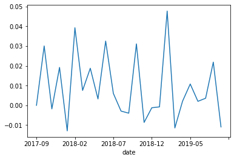
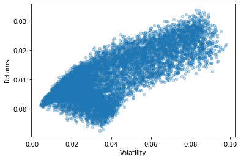
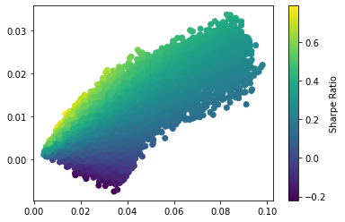
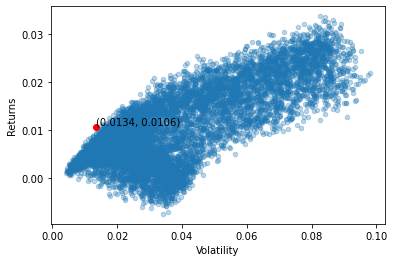

```python
## 导入基础类库
import pandas as pd
import numpy as np
data1 = pd.read_excel("D:\OneDrive\桌面\model\附件2：302家无信贷记录企业的相关数据.xlsx", sheet_name='企业信息')
data2 = pd.read_excel("D:\OneDrive\桌面\model\附件2：302家无信贷记录企业的相关数据.xlsx", sheet_name='进项发票信息')
data3 = pd.read_excel("D:\OneDrive\桌面\model\附件2：302家无信贷记录企业的相关数据.xlsx", sheet_name='销项发票信息')
```


```python
income_n = pd.merge(data1,data2,on='企业代号')
income_n
```


<div>
<style scoped>
    .dataframe tbody tr th:only-of-type {
        vertical-align: middle;
    }

    .dataframe tbody tr th {
        vertical-align: top;
    }

    .dataframe thead th {
        text-align: right;
    }
</style>
<table border="1" class="dataframe">
  <thead>
    <tr style="text-align: right;">
      <th></th>
      <th>企业代号</th>
      <th>企业名称</th>
      <th>发票号码</th>
      <th>开票日期</th>
      <th>销方单位代号</th>
      <th>金额</th>
      <th>税额</th>
      <th>价税合计</th>
      <th>发票状态</th>
    </tr>
  </thead>
  <tbody>
    <tr>
      <th>0</th>
      <td>E124</td>
      <td>个体经营E124</td>
      <td>18891676</td>
      <td>2017-09-01 00:00:00</td>
      <td>C00014</td>
      <td>338.46</td>
      <td>57.54</td>
      <td>396.0</td>
      <td>有效发票</td>
    </tr>
    <tr>
      <th>1</th>
      <td>E124</td>
      <td>个体经营E124</td>
      <td>18691267</td>
      <td>2017-09-01 00:00:00</td>
      <td>C00480</td>
      <td>230.10</td>
      <td>6.90</td>
      <td>237.0</td>
      <td>有效发票</td>
    </tr>
    <tr>
      <th>2</th>
      <td>E124</td>
      <td>个体经营E124</td>
      <td>12995412</td>
      <td>2017-09-01 00:00:00</td>
      <td>C23675</td>
      <td>223.30</td>
      <td>6.70</td>
      <td>230.0</td>
      <td>有效发票</td>
    </tr>
    <tr>
      <th>3</th>
      <td>E124</td>
      <td>个体经营E124</td>
      <td>6378193</td>
      <td>2017-09-01 11:11:03</td>
      <td>C00333</td>
      <td>90090.09</td>
      <td>9909.91</td>
      <td>100000.0</td>
      <td>有效发票</td>
    </tr>
    <tr>
      <th>4</th>
      <td>E124</td>
      <td>个体经营E124</td>
      <td>6378194</td>
      <td>2017-09-01 11:12:01</td>
      <td>C00333</td>
      <td>90090.09</td>
      <td>9909.91</td>
      <td>100000.0</td>
      <td>有效发票</td>
    </tr>
    <tr>
      <th>...</th>
      <td>...</td>
      <td>...</td>
      <td>...</td>
      <td>...</td>
      <td>...</td>
      <td>...</td>
      <td>...</td>
      <td>...</td>
      <td>...</td>
    </tr>
    <tr>
      <th>395170</th>
      <td>E425</td>
      <td>***商贸有限公司</td>
      <td>72101375</td>
      <td>2019-12-30 00:00:00</td>
      <td>C23112</td>
      <td>663.11</td>
      <td>19.89</td>
      <td>683.0</td>
      <td>有效发票</td>
    </tr>
    <tr>
      <th>395171</th>
      <td>E425</td>
      <td>***商贸有限公司</td>
      <td>20253285</td>
      <td>2020-01-05 00:00:00</td>
      <td>C01937</td>
      <td>45.41</td>
      <td>4.09</td>
      <td>49.5</td>
      <td>有效发票</td>
    </tr>
    <tr>
      <th>395172</th>
      <td>E425</td>
      <td>***商贸有限公司</td>
      <td>20253315</td>
      <td>2020-01-05 00:00:00</td>
      <td>C01937</td>
      <td>110.14</td>
      <td>1.16</td>
      <td>111.3</td>
      <td>有效发票</td>
    </tr>
    <tr>
      <th>395173</th>
      <td>E425</td>
      <td>***商贸有限公司</td>
      <td>52449404</td>
      <td>2020-01-06 00:00:00</td>
      <td>C15032</td>
      <td>73.22</td>
      <td>6.58</td>
      <td>79.8</td>
      <td>有效发票</td>
    </tr>
    <tr>
      <th>395174</th>
      <td>E425</td>
      <td>***商贸有限公司</td>
      <td>5666299</td>
      <td>2020-01-10 00:00:00</td>
      <td>C23112</td>
      <td>132.04</td>
      <td>3.96</td>
      <td>136.0</td>
      <td>有效发票</td>
    </tr>
  </tbody>
</table>
<p>395175 rows × 9 columns</p>
</div>


```python
expense_n = pd.merge(data1, data3, on = '企业代号')
expense_n
```


<div>
<style scoped>
    .dataframe tbody tr th:only-of-type {
        vertical-align: middle;
    }

    .dataframe tbody tr th {
        vertical-align: top;
    }

    .dataframe thead th {
        text-align: right;
    }
</style>
<table border="1" class="dataframe">
  <thead>
    <tr style="text-align: right;">
      <th></th>
      <th>企业代号</th>
      <th>企业名称</th>
      <th>发票号码</th>
      <th>开票日期</th>
      <th>购方单位代号</th>
      <th>金额</th>
      <th>税额</th>
      <th>价税合计</th>
      <th>发票状态</th>
    </tr>
  </thead>
  <tbody>
    <tr>
      <th>0</th>
      <td>E124</td>
      <td>个体经营E124</td>
      <td>15212483</td>
      <td>2017-09-01 11:58:43</td>
      <td>D00585</td>
      <td>839350.55</td>
      <td>92328.56</td>
      <td>931679.11</td>
      <td>有效发票</td>
    </tr>
    <tr>
      <th>1</th>
      <td>E124</td>
      <td>个体经营E124</td>
      <td>15212484</td>
      <td>2017-09-01 11:59:20</td>
      <td>D00585</td>
      <td>900900.90</td>
      <td>99099.10</td>
      <td>1000000.00</td>
      <td>有效发票</td>
    </tr>
    <tr>
      <th>2</th>
      <td>E124</td>
      <td>个体经营E124</td>
      <td>15212485</td>
      <td>2017-09-01 11:59:51</td>
      <td>D00585</td>
      <td>900900.90</td>
      <td>99099.10</td>
      <td>1000000.00</td>
      <td>有效发票</td>
    </tr>
    <tr>
      <th>3</th>
      <td>E124</td>
      <td>个体经营E124</td>
      <td>15212486</td>
      <td>2017-09-01 12:00:45</td>
      <td>D00585</td>
      <td>697365.74</td>
      <td>76710.23</td>
      <td>774075.97</td>
      <td>有效发票</td>
    </tr>
    <tr>
      <th>4</th>
      <td>E124</td>
      <td>个体经营E124</td>
      <td>6089615</td>
      <td>2017-09-05 10:58:38</td>
      <td>D00108</td>
      <td>726216.22</td>
      <td>79883.78</td>
      <td>806100.00</td>
      <td>有效发票</td>
    </tr>
    <tr>
      <th>...</th>
      <td>...</td>
      <td>...</td>
      <td>...</td>
      <td>...</td>
      <td>...</td>
      <td>...</td>
      <td>...</td>
      <td>...</td>
      <td>...</td>
    </tr>
    <tr>
      <th>330830</th>
      <td>E425</td>
      <td>***商贸有限公司</td>
      <td>21803468</td>
      <td>2018-04-03 00:00:00</td>
      <td>D21446</td>
      <td>9000.00</td>
      <td>270.00</td>
      <td>9270.00</td>
      <td>有效发票</td>
    </tr>
    <tr>
      <th>330831</th>
      <td>E425</td>
      <td>***商贸有限公司</td>
      <td>21803469</td>
      <td>2018-04-03 00:00:00</td>
      <td>D21446</td>
      <td>5155.34</td>
      <td>154.66</td>
      <td>5310.00</td>
      <td>有效发票</td>
    </tr>
    <tr>
      <th>330832</th>
      <td>E425</td>
      <td>***商贸有限公司</td>
      <td>21803470</td>
      <td>2019-06-11 00:00:00</td>
      <td>D02126</td>
      <td>4854.37</td>
      <td>145.63</td>
      <td>5000.00</td>
      <td>作废发票</td>
    </tr>
    <tr>
      <th>330833</th>
      <td>E425</td>
      <td>***商贸有限公司</td>
      <td>21803471</td>
      <td>2019-06-11 00:00:00</td>
      <td>D02126</td>
      <td>4854.37</td>
      <td>145.63</td>
      <td>5000.00</td>
      <td>作废发票</td>
    </tr>
    <tr>
      <th>330834</th>
      <td>E425</td>
      <td>***商贸有限公司</td>
      <td>21803472</td>
      <td>2019-06-11 00:00:00</td>
      <td>D02126</td>
      <td>4854.37</td>
      <td>145.63</td>
      <td>5000.00</td>
      <td>有效发票</td>
    </tr>
  </tbody>
</table>
<p>330835 rows × 9 columns</p>
</div>


```python
income_n['count'] = 1
income_n = income_n.groupby(['企业代号','发票状态']).sum().reset_index()
income_n = income_n.set_index('企业代号')
display(income_n)
expense_n['count'] = 1
expense_n = expense_n.groupby(['企业代号','发票状态']).sum().reset_index()
expense_n = expense_n.set_index('企业代号')
display(expense_n)
```


<div>
<style scoped>
    .dataframe tbody tr th:only-of-type {
        vertical-align: middle;
    }

    .dataframe tbody tr th {
        vertical-align: top;
    }

    .dataframe thead th {
        text-align: right;
    }
</style>
<table border="1" class="dataframe">
  <thead>
    <tr style="text-align: right;">
      <th></th>
      <th>发票状态</th>
      <th>发票号码</th>
      <th>金额</th>
      <th>税额</th>
      <th>价税合计</th>
      <th>count</th>
    </tr>
    <tr>
      <th>企业代号</th>
      <th></th>
      <th></th>
      <th></th>
      <th></th>
      <th></th>
      <th></th>
    </tr>
  </thead>
  <tbody>
    <tr>
      <th>E124</th>
      <td>作废发票</td>
      <td>18485197094</td>
      <td>1.367530e+08</td>
      <td>1.122547e+07</td>
      <td>1.479785e+08</td>
      <td>2147</td>
    </tr>
    <tr>
      <th>E124</th>
      <td>有效发票</td>
      <td>277661344362</td>
      <td>7.855255e+08</td>
      <td>5.867726e+07</td>
      <td>8.442028e+08</td>
      <td>15264</td>
    </tr>
    <tr>
      <th>E125</th>
      <td>作废发票</td>
      <td>20980743859</td>
      <td>1.635209e+08</td>
      <td>1.309048e+07</td>
      <td>1.766114e+08</td>
      <td>2512</td>
    </tr>
    <tr>
      <th>E125</th>
      <td>有效发票</td>
      <td>316654902831</td>
      <td>9.323832e+08</td>
      <td>6.881856e+07</td>
      <td>1.001202e+09</td>
      <td>17776</td>
    </tr>
    <tr>
      <th>E126</th>
      <td>作废发票</td>
      <td>123556937</td>
      <td>4.553719e+06</td>
      <td>6.338982e+05</td>
      <td>5.187617e+06</td>
      <td>18</td>
    </tr>
    <tr>
      <th>...</th>
      <td>...</td>
      <td>...</td>
      <td>...</td>
      <td>...</td>
      <td>...</td>
      <td>...</td>
    </tr>
    <tr>
      <th>E422</th>
      <td>有效发票</td>
      <td>69721013</td>
      <td>8.893900e+02</td>
      <td>7.061000e+01</td>
      <td>9.600000e+02</td>
      <td>3</td>
    </tr>
    <tr>
      <th>E423</th>
      <td>有效发票</td>
      <td>194717438</td>
      <td>6.104614e+04</td>
      <td>8.005560e+03</td>
      <td>6.905170e+04</td>
      <td>21</td>
    </tr>
    <tr>
      <th>E424</th>
      <td>有效发票</td>
      <td>930134163</td>
      <td>2.543299e+05</td>
      <td>1.766949e+04</td>
      <td>2.719994e+05</td>
      <td>25</td>
    </tr>
    <tr>
      <th>E425</th>
      <td>作废发票</td>
      <td>20015563</td>
      <td>2.323270e+03</td>
      <td>3.555700e+02</td>
      <td>2.678840e+03</td>
      <td>2</td>
    </tr>
    <tr>
      <th>E425</th>
      <td>有效发票</td>
      <td>4288022596</td>
      <td>5.719625e+04</td>
      <td>4.885150e+03</td>
      <td>6.208140e+04</td>
      <td>116</td>
    </tr>
  </tbody>
</table>
<p>559 rows × 6 columns</p>
</div>


<div>
<style scoped>
    .dataframe tbody tr th:only-of-type {
        vertical-align: middle;
    }

    .dataframe tbody tr th {
        vertical-align: top;
    }

    .dataframe thead th {
        text-align: right;
    }
</style>
<table border="1" class="dataframe">
  <thead>
    <tr style="text-align: right;">
      <th></th>
      <th>发票状态</th>
      <th>发票号码</th>
      <th>金额</th>
      <th>税额</th>
      <th>价税合计</th>
      <th>count</th>
    </tr>
    <tr>
      <th>企业代号</th>
      <th></th>
      <th></th>
      <th></th>
      <th></th>
      <th></th>
      <th></th>
    </tr>
  </thead>
  <tbody>
    <tr>
      <th>E124</th>
      <td>作废发票</td>
      <td>1830704441</td>
      <td>1.440284e+08</td>
      <td>1.259549e+07</td>
      <td>1.566239e+08</td>
      <td>194</td>
    </tr>
    <tr>
      <th>E124</th>
      <td>有效发票</td>
      <td>14077796534</td>
      <td>7.417804e+08</td>
      <td>6.665738e+07</td>
      <td>8.084377e+08</td>
      <td>1099</td>
    </tr>
    <tr>
      <th>E125</th>
      <td>作废发票</td>
      <td>2025956583</td>
      <td>1.566404e+08</td>
      <td>1.362354e+07</td>
      <td>1.702639e+08</td>
      <td>215</td>
    </tr>
    <tr>
      <th>E125</th>
      <td>有效发票</td>
      <td>17190888620</td>
      <td>9.412114e+08</td>
      <td>8.362975e+07</td>
      <td>1.024841e+09</td>
      <td>1380</td>
    </tr>
    <tr>
      <th>E126</th>
      <td>作废发票</td>
      <td>1797543664</td>
      <td>1.081433e+08</td>
      <td>4.158411e+06</td>
      <td>1.123017e+08</td>
      <td>252</td>
    </tr>
    <tr>
      <th>...</th>
      <td>...</td>
      <td>...</td>
      <td>...</td>
      <td>...</td>
      <td>...</td>
      <td>...</td>
    </tr>
    <tr>
      <th>E423</th>
      <td>有效发票</td>
      <td>13137670</td>
      <td>7.278640e+04</td>
      <td>2.183600e+03</td>
      <td>7.497000e+04</td>
      <td>6</td>
    </tr>
    <tr>
      <th>E424</th>
      <td>作废发票</td>
      <td>163730190</td>
      <td>1.095382e+04</td>
      <td>5.284900e+02</td>
      <td>1.148231e+04</td>
      <td>6</td>
    </tr>
    <tr>
      <th>E424</th>
      <td>有效发票</td>
      <td>673535652</td>
      <td>7.689642e+04</td>
      <td>2.306880e+03</td>
      <td>7.920330e+04</td>
      <td>37</td>
    </tr>
    <tr>
      <th>E425</th>
      <td>作废发票</td>
      <td>174427686</td>
      <td>6.744854e+04</td>
      <td>2.023460e+03</td>
      <td>6.947200e+04</td>
      <td>8</td>
    </tr>
    <tr>
      <th>E425</th>
      <td>有效发票</td>
      <td>218034657</td>
      <td>8.512621e+04</td>
      <td>2.553790e+03</td>
      <td>8.768000e+04</td>
      <td>10</td>
    </tr>
  </tbody>
</table>
<p>605 rows × 6 columns</p>
</div>


```python
income_n['sum'] = income_n.groupby('企业代号')['count'].sum()
income_n['ratio'] = income_n['count']/income_n['sum']
display(income_n)
expense_n['sum'] = expense_n.groupby('企业代号')['count'].sum()
expense_n['ratio'] = expense_n['count']/expense_n['sum']
display(expense_n)
```


<div>
<style scoped>
    .dataframe tbody tr th:only-of-type {
        vertical-align: middle;
    }

    .dataframe tbody tr th {
        vertical-align: top;
    }

    .dataframe thead th {
        text-align: right;
    }
</style>
<table border="1" class="dataframe">
  <thead>
    <tr style="text-align: right;">
      <th></th>
      <th>发票状态</th>
      <th>发票号码</th>
      <th>金额</th>
      <th>税额</th>
      <th>价税合计</th>
      <th>count</th>
      <th>sum</th>
      <th>ratio</th>
    </tr>
    <tr>
      <th>企业代号</th>
      <th></th>
      <th></th>
      <th></th>
      <th></th>
      <th></th>
      <th></th>
      <th></th>
      <th></th>
    </tr>
  </thead>
  <tbody>
    <tr>
      <th>E124</th>
      <td>作废发票</td>
      <td>18485197094</td>
      <td>1.367530e+08</td>
      <td>1.122547e+07</td>
      <td>1.479785e+08</td>
      <td>2147</td>
      <td>17411</td>
      <td>0.123313</td>
    </tr>
    <tr>
      <th>E124</th>
      <td>有效发票</td>
      <td>277661344362</td>
      <td>7.855255e+08</td>
      <td>5.867726e+07</td>
      <td>8.442028e+08</td>
      <td>15264</td>
      <td>17411</td>
      <td>0.876687</td>
    </tr>
    <tr>
      <th>E125</th>
      <td>作废发票</td>
      <td>20980743859</td>
      <td>1.635209e+08</td>
      <td>1.309048e+07</td>
      <td>1.766114e+08</td>
      <td>2512</td>
      <td>20288</td>
      <td>0.123817</td>
    </tr>
    <tr>
      <th>E125</th>
      <td>有效发票</td>
      <td>316654902831</td>
      <td>9.323832e+08</td>
      <td>6.881856e+07</td>
      <td>1.001202e+09</td>
      <td>17776</td>
      <td>20288</td>
      <td>0.876183</td>
    </tr>
    <tr>
      <th>E126</th>
      <td>作废发票</td>
      <td>123556937</td>
      <td>4.553719e+06</td>
      <td>6.338982e+05</td>
      <td>5.187617e+06</td>
      <td>18</td>
      <td>533</td>
      <td>0.033771</td>
    </tr>
    <tr>
      <th>...</th>
      <td>...</td>
      <td>...</td>
      <td>...</td>
      <td>...</td>
      <td>...</td>
      <td>...</td>
      <td>...</td>
      <td>...</td>
    </tr>
    <tr>
      <th>E422</th>
      <td>有效发票</td>
      <td>69721013</td>
      <td>8.893900e+02</td>
      <td>7.061000e+01</td>
      <td>9.600000e+02</td>
      <td>3</td>
      <td>3</td>
      <td>1.000000</td>
    </tr>
    <tr>
      <th>E423</th>
      <td>有效发票</td>
      <td>194717438</td>
      <td>6.104614e+04</td>
      <td>8.005560e+03</td>
      <td>6.905170e+04</td>
      <td>21</td>
      <td>21</td>
      <td>1.000000</td>
    </tr>
    <tr>
      <th>E424</th>
      <td>有效发票</td>
      <td>930134163</td>
      <td>2.543299e+05</td>
      <td>1.766949e+04</td>
      <td>2.719994e+05</td>
      <td>25</td>
      <td>25</td>
      <td>1.000000</td>
    </tr>
    <tr>
      <th>E425</th>
      <td>作废发票</td>
      <td>20015563</td>
      <td>2.323270e+03</td>
      <td>3.555700e+02</td>
      <td>2.678840e+03</td>
      <td>2</td>
      <td>118</td>
      <td>0.016949</td>
    </tr>
    <tr>
      <th>E425</th>
      <td>有效发票</td>
      <td>4288022596</td>
      <td>5.719625e+04</td>
      <td>4.885150e+03</td>
      <td>6.208140e+04</td>
      <td>116</td>
      <td>118</td>
      <td>0.983051</td>
    </tr>
  </tbody>
</table>
<p>559 rows × 8 columns</p>
</div>


<div>
<style scoped>
    .dataframe tbody tr th:only-of-type {
        vertical-align: middle;
    }

    .dataframe tbody tr th {
        vertical-align: top;
    }

    .dataframe thead th {
        text-align: right;
    }
</style>
<table border="1" class="dataframe">
  <thead>
    <tr style="text-align: right;">
      <th></th>
      <th>发票状态</th>
      <th>发票号码</th>
      <th>金额</th>
      <th>税额</th>
      <th>价税合计</th>
      <th>count</th>
      <th>sum</th>
      <th>ratio</th>
    </tr>
    <tr>
      <th>企业代号</th>
      <th></th>
      <th></th>
      <th></th>
      <th></th>
      <th></th>
      <th></th>
      <th></th>
      <th></th>
    </tr>
  </thead>
  <tbody>
    <tr>
      <th>E124</th>
      <td>作废发票</td>
      <td>1830704441</td>
      <td>1.440284e+08</td>
      <td>1.259549e+07</td>
      <td>1.566239e+08</td>
      <td>194</td>
      <td>1293</td>
      <td>0.150039</td>
    </tr>
    <tr>
      <th>E124</th>
      <td>有效发票</td>
      <td>14077796534</td>
      <td>7.417804e+08</td>
      <td>6.665738e+07</td>
      <td>8.084377e+08</td>
      <td>1099</td>
      <td>1293</td>
      <td>0.849961</td>
    </tr>
    <tr>
      <th>E125</th>
      <td>作废发票</td>
      <td>2025956583</td>
      <td>1.566404e+08</td>
      <td>1.362354e+07</td>
      <td>1.702639e+08</td>
      <td>215</td>
      <td>1595</td>
      <td>0.134796</td>
    </tr>
    <tr>
      <th>E125</th>
      <td>有效发票</td>
      <td>17190888620</td>
      <td>9.412114e+08</td>
      <td>8.362975e+07</td>
      <td>1.024841e+09</td>
      <td>1380</td>
      <td>1595</td>
      <td>0.865204</td>
    </tr>
    <tr>
      <th>E126</th>
      <td>作废发票</td>
      <td>1797543664</td>
      <td>1.081433e+08</td>
      <td>4.158411e+06</td>
      <td>1.123017e+08</td>
      <td>252</td>
      <td>1516</td>
      <td>0.166227</td>
    </tr>
    <tr>
      <th>...</th>
      <td>...</td>
      <td>...</td>
      <td>...</td>
      <td>...</td>
      <td>...</td>
      <td>...</td>
      <td>...</td>
      <td>...</td>
    </tr>
    <tr>
      <th>E423</th>
      <td>有效发票</td>
      <td>13137670</td>
      <td>7.278640e+04</td>
      <td>2.183600e+03</td>
      <td>7.497000e+04</td>
      <td>6</td>
      <td>7</td>
      <td>0.857143</td>
    </tr>
    <tr>
      <th>E424</th>
      <td>作废发票</td>
      <td>163730190</td>
      <td>1.095382e+04</td>
      <td>5.284900e+02</td>
      <td>1.148231e+04</td>
      <td>6</td>
      <td>43</td>
      <td>0.139535</td>
    </tr>
    <tr>
      <th>E424</th>
      <td>有效发票</td>
      <td>673535652</td>
      <td>7.689642e+04</td>
      <td>2.306880e+03</td>
      <td>7.920330e+04</td>
      <td>37</td>
      <td>43</td>
      <td>0.860465</td>
    </tr>
    <tr>
      <th>E425</th>
      <td>作废发票</td>
      <td>174427686</td>
      <td>6.744854e+04</td>
      <td>2.023460e+03</td>
      <td>6.947200e+04</td>
      <td>8</td>
      <td>18</td>
      <td>0.444444</td>
    </tr>
    <tr>
      <th>E425</th>
      <td>有效发票</td>
      <td>218034657</td>
      <td>8.512621e+04</td>
      <td>2.553790e+03</td>
      <td>8.768000e+04</td>
      <td>10</td>
      <td>18</td>
      <td>0.555556</td>
    </tr>
  </tbody>
</table>
<p>605 rows × 8 columns</p>
</div>


```python
income = income_n[income_n['发票状态'] == '作废发票'].reset_index()
income = income[['企业代号','ratio']].set_index('企业代号')
display(income)
expense = expense_n[expense_n['发票状态'] == '作废发票'].reset_index()
expense = expense[['企业代号','ratio']].set_index('企业代号')
display(expense)
```


<div>
<style scoped>
    .dataframe tbody tr th:only-of-type {
        vertical-align: middle;
    }

    .dataframe tbody tr th {
        vertical-align: top;
    }

    .dataframe thead th {
        text-align: right;
    }
</style>
<table border="1" class="dataframe">
  <thead>
    <tr style="text-align: right;">
      <th></th>
      <th>ratio</th>
    </tr>
    <tr>
      <th>企业代号</th>
      <th></th>
    </tr>
  </thead>
  <tbody>
    <tr>
      <th>E124</th>
      <td>0.123313</td>
    </tr>
    <tr>
      <th>E125</th>
      <td>0.123817</td>
    </tr>
    <tr>
      <th>E126</th>
      <td>0.033771</td>
    </tr>
    <tr>
      <th>E127</th>
      <td>0.017931</td>
    </tr>
    <tr>
      <th>E128</th>
      <td>0.027312</td>
    </tr>
    <tr>
      <th>...</th>
      <td>...</td>
    </tr>
    <tr>
      <th>E416</th>
      <td>0.125000</td>
    </tr>
    <tr>
      <th>E417</th>
      <td>0.007812</td>
    </tr>
    <tr>
      <th>E419</th>
      <td>0.019939</td>
    </tr>
    <tr>
      <th>E420</th>
      <td>0.013072</td>
    </tr>
    <tr>
      <th>E425</th>
      <td>0.016949</td>
    </tr>
  </tbody>
</table>
<p>257 rows × 1 columns</p>
</div>


<div>
<style scoped>
    .dataframe tbody tr th:only-of-type {
        vertical-align: middle;
    }

    .dataframe tbody tr th {
        vertical-align: top;
    }

    .dataframe thead th {
        text-align: right;
    }
</style>
<table border="1" class="dataframe">
  <thead>
    <tr style="text-align: right;">
      <th></th>
      <th>ratio</th>
    </tr>
    <tr>
      <th>企业代号</th>
      <th></th>
    </tr>
  </thead>
  <tbody>
    <tr>
      <th>E124</th>
      <td>0.150039</td>
    </tr>
    <tr>
      <th>E125</th>
      <td>0.134796</td>
    </tr>
    <tr>
      <th>E126</th>
      <td>0.166227</td>
    </tr>
    <tr>
      <th>E127</th>
      <td>0.030303</td>
    </tr>
    <tr>
      <th>E128</th>
      <td>0.074900</td>
    </tr>
    <tr>
      <th>...</th>
      <td>...</td>
    </tr>
    <tr>
      <th>E421</th>
      <td>0.034483</td>
    </tr>
    <tr>
      <th>E422</th>
      <td>0.100000</td>
    </tr>
    <tr>
      <th>E423</th>
      <td>0.142857</td>
    </tr>
    <tr>
      <th>E424</th>
      <td>0.139535</td>
    </tr>
    <tr>
      <th>E425</th>
      <td>0.444444</td>
    </tr>
  </tbody>
</table>
<p>295 rows × 1 columns</p>
</div>


```python
ratio = (expense.fillna(0)+income.fillna(0))/2
for column in list(ratio.columns[ratio.isnull().sum() > 0]):
    mean_val = ratio[column].mean()
    ratio[column].fillna(mean_val, inplace=True)

ratio.loc['E349'] = '0.083856'
ratio.loc['E382'] = '0.083856'
ratio.loc['E390'] = '0.083856'
ratio.loc['E415'] = '0.083856'
ratio
```


<div>
<style scoped>
    .dataframe tbody tr th:only-of-type {
        vertical-align: middle;
    }

    .dataframe tbody tr th {
        vertical-align: top;
    }

    .dataframe thead th {
        text-align: right;
    }
</style>
<table border="1" class="dataframe">
  <thead>
    <tr style="text-align: right;">
      <th></th>
      <th>ratio</th>
    </tr>
    <tr>
      <th>企业代号</th>
      <th></th>
    </tr>
  </thead>
  <tbody>
    <tr>
      <th>E124</th>
      <td>0.136676</td>
    </tr>
    <tr>
      <th>E125</th>
      <td>0.129307</td>
    </tr>
    <tr>
      <th>E126</th>
      <td>0.099999</td>
    </tr>
    <tr>
      <th>E127</th>
      <td>0.024117</td>
    </tr>
    <tr>
      <th>E128</th>
      <td>0.0511063</td>
    </tr>
    <tr>
      <th>...</th>
      <td>...</td>
    </tr>
    <tr>
      <th>E425</th>
      <td>0.230697</td>
    </tr>
    <tr>
      <th>E349</th>
      <td>0.083856</td>
    </tr>
    <tr>
      <th>E382</th>
      <td>0.083856</td>
    </tr>
    <tr>
      <th>E390</th>
      <td>0.083856</td>
    </tr>
    <tr>
      <th>E415</th>
      <td>0.083856</td>
    </tr>
  </tbody>
</table>
<p>302 rows × 1 columns</p>
</div>


```python
income_n = pd.merge(data1,data2,on='企业代号')
expense_n = pd.merge(data1, data3, on = '企业代号')

from datetime import datetime
income_n['开票日期'] = pd.to_datetime(income_n['开票日期'], format='%Y-%m-%d %H:%M:%S')
income_n['date']=income_n['开票日期']
income_n['date'] =income_n['date'].apply(lambda x:datetime.strftime(x,'%Y-%m'))

expense_n['开票日期'] = pd.to_datetime(expense_n['开票日期'], format='%Y-%m-%d %H:%M:%S')
expense_n['date']=expense_n['开票日期']
expense_n['date'] =expense_n['date'].apply(lambda x:datetime.strftime(x,'%Y-%m'))
company_out = income_n[income_n['发票状态'] == '有效发票'].groupby(['企业代号','date']).sum().reset_index()
company_out = company_out.set_index("date")
company_in = expense_n[expense_n['发票状态'] == '有效发票'].groupby(['企业代号','date']).sum().reset_index()
company_in = company_in.set_index("date")
```


```python
company_data_t = pd.merge(company_in, company_out, how='outer', on=['企业代号','date']) 
company_data_t = company_data_t.fillna(0)
company_data_t['profit'] = company_data_t['价税合计_y'] - company_data_t['价税合计_x']
company_data_t
```


<div>
<style scoped>
    .dataframe tbody tr th:only-of-type {
        vertical-align: middle;
    }

    .dataframe tbody tr th {
        vertical-align: top;
    }

    .dataframe thead th {
        text-align: right;
    }
</style>
<table border="1" class="dataframe">
  <thead>
    <tr style="text-align: right;">
      <th></th>
      <th>企业代号</th>
      <th>发票号码_x</th>
      <th>金额_x</th>
      <th>税额_x</th>
      <th>价税合计_x</th>
      <th>发票号码_y</th>
      <th>金额_y</th>
      <th>税额_y</th>
      <th>价税合计_y</th>
      <th>profit</th>
    </tr>
    <tr>
      <th>date</th>
      <th></th>
      <th></th>
      <th></th>
      <th></th>
      <th></th>
      <th></th>
      <th></th>
      <th></th>
      <th></th>
      <th></th>
    </tr>
  </thead>
  <tbody>
    <tr>
      <th>2017-09</th>
      <td>E124</td>
      <td>452525272.0</td>
      <td>14590753.09</td>
      <td>725181.90</td>
      <td>15315934.99</td>
      <td>3.092362e+09</td>
      <td>15961026.34</td>
      <td>1097205.79</td>
      <td>17058232.13</td>
      <td>1742297.14</td>
    </tr>
    <tr>
      <th>2017-10</th>
      <td>E124</td>
      <td>243931657.0</td>
      <td>14873606.03</td>
      <td>1615525.25</td>
      <td>16489131.28</td>
      <td>2.774006e+09</td>
      <td>10741042.73</td>
      <td>897149.66</td>
      <td>11638192.39</td>
      <td>-4850938.89</td>
    </tr>
    <tr>
      <th>2017-11</th>
      <td>E124</td>
      <td>105426916.0</td>
      <td>18023810.32</td>
      <td>1508828.80</td>
      <td>19532639.12</td>
      <td>4.083388e+09</td>
      <td>14512592.99</td>
      <td>1120696.10</td>
      <td>15633289.09</td>
      <td>-3899350.03</td>
    </tr>
    <tr>
      <th>2017-12</th>
      <td>E124</td>
      <td>409701799.0</td>
      <td>39675314.43</td>
      <td>2641007.09</td>
      <td>42316321.52</td>
      <td>5.013643e+09</td>
      <td>21876265.20</td>
      <td>1806385.95</td>
      <td>23682651.15</td>
      <td>-18633670.37</td>
    </tr>
    <tr>
      <th>2018-01</th>
      <td>E124</td>
      <td>357393996.0</td>
      <td>21356615.76</td>
      <td>2043208.37</td>
      <td>23399824.13</td>
      <td>4.981678e+09</td>
      <td>37188599.69</td>
      <td>2480415.64</td>
      <td>39669015.33</td>
      <td>16269191.20</td>
    </tr>
    <tr>
      <th>...</th>
      <td>...</td>
      <td>...</td>
      <td>...</td>
      <td>...</td>
      <td>...</td>
      <td>...</td>
      <td>...</td>
      <td>...</td>
      <td>...</td>
      <td>...</td>
    </tr>
    <tr>
      <th>2019-09</th>
      <td>E425</td>
      <td>0.0</td>
      <td>0.00</td>
      <td>0.00</td>
      <td>0.00</td>
      <td>2.446893e+07</td>
      <td>1354.31</td>
      <td>50.09</td>
      <td>1404.40</td>
      <td>1404.40</td>
    </tr>
    <tr>
      <th>2019-10</th>
      <td>E425</td>
      <td>0.0</td>
      <td>0.00</td>
      <td>0.00</td>
      <td>0.00</td>
      <td>2.706878e+08</td>
      <td>4238.79</td>
      <td>256.16</td>
      <td>4494.95</td>
      <td>4494.95</td>
    </tr>
    <tr>
      <th>2019-11</th>
      <td>E425</td>
      <td>0.0</td>
      <td>0.00</td>
      <td>0.00</td>
      <td>0.00</td>
      <td>3.338665e+08</td>
      <td>4271.70</td>
      <td>217.16</td>
      <td>4488.86</td>
      <td>4488.86</td>
    </tr>
    <tr>
      <th>2019-12</th>
      <td>E425</td>
      <td>0.0</td>
      <td>0.00</td>
      <td>0.00</td>
      <td>0.00</td>
      <td>1.087899e+08</td>
      <td>1065.74</td>
      <td>70.29</td>
      <td>1136.03</td>
      <td>1136.03</td>
    </tr>
    <tr>
      <th>2020-01</th>
      <td>E425</td>
      <td>0.0</td>
      <td>0.00</td>
      <td>0.00</td>
      <td>0.00</td>
      <td>9.862230e+07</td>
      <td>360.81</td>
      <td>15.79</td>
      <td>376.60</td>
      <td>376.60</td>
    </tr>
  </tbody>
</table>
<p>9728 rows × 10 columns</p>
</div>


```python
company_data = company_data_t.reset_index()[['date', '企业代号', 'profit']]
company_data = company_data.set_index("date")
company_data["profit_sum"] = company_data["profit"].cumsum(axis=0)
efficiency = (0.039571+0.039924+0.039277)/3
company_data["profit_sum"] = company_data["profit_sum"]*efficiency

company_data["profit_sum"] = company_data.apply(lambda row: row['profit_sum']*float(ratio.loc[row['企业代号']]), axis=1)
company_data
```


<div>
<style scoped>
    .dataframe tbody tr th:only-of-type {
        vertical-align: middle;
    }

    .dataframe tbody tr th {
        vertical-align: top;
    }

    .dataframe thead th {
        text-align: right;
    }
</style>
<table border="1" class="dataframe">
  <thead>
    <tr style="text-align: right;">
      <th></th>
      <th>企业代号</th>
      <th>profit</th>
      <th>profit_sum</th>
    </tr>
    <tr>
      <th>date</th>
      <th></th>
      <th></th>
      <th></th>
    </tr>
  </thead>
  <tbody>
    <tr>
      <th>2017-09</th>
      <td>E124</td>
      <td>1742297.14</td>
      <td>9.427717e+03</td>
    </tr>
    <tr>
      <th>2017-10</th>
      <td>E124</td>
      <td>-4850938.89</td>
      <td>-1.682112e+04</td>
    </tr>
    <tr>
      <th>2017-11</th>
      <td>E124</td>
      <td>-3899350.03</td>
      <td>-3.792084e+04</td>
    </tr>
    <tr>
      <th>2017-12</th>
      <td>E124</td>
      <td>-18633670.37</td>
      <td>-1.387492e+05</td>
    </tr>
    <tr>
      <th>2018-01</th>
      <td>E124</td>
      <td>16269191.20</td>
      <td>-5.071523e+04</td>
    </tr>
    <tr>
      <th>...</th>
      <td>...</td>
      <td>...</td>
      <td>...</td>
    </tr>
    <tr>
      <th>2019-09</th>
      <td>E425</td>
      <td>1404.40</td>
      <td>-6.667958e+07</td>
    </tr>
    <tr>
      <th>2019-10</th>
      <td>E425</td>
      <td>4494.95</td>
      <td>-6.667953e+07</td>
    </tr>
    <tr>
      <th>2019-11</th>
      <td>E425</td>
      <td>4488.86</td>
      <td>-6.667949e+07</td>
    </tr>
    <tr>
      <th>2019-12</th>
      <td>E425</td>
      <td>1136.03</td>
      <td>-6.667948e+07</td>
    </tr>
    <tr>
      <th>2020-01</th>
      <td>E425</td>
      <td>376.60</td>
      <td>-6.667948e+07</td>
    </tr>
  </tbody>
</table>
<p>9728 rows × 3 columns</p>
</div>


```python
# 创建空的DataFrame变量，用于存储公司数据
CompanyProfit = pd.DataFrame()

#profit_value_list=[]  #存储每个公司的平均市值

# 创建公司代号的列表
company_list = data1['企业代号'].tolist()
# 使用循环，挨个获取每只股票的数据，并存储每日收盘价
for company in company_list:
    company_profit = company_data[company_data['企业代号'] == company]
    
    CompanyProfit[company] = company_profit['profit_sum']  #获取每个公司的利润

CompanyProfit.index.name = 'date'  #日期为索引列
# 输出数据的前5行
for column in list(CompanyProfit.columns[CompanyProfit.isnull().sum() > 0]):
    mean_val = CompanyProfit[column].mean()
    CompanyProfit[column].fillna(mean_val, inplace=True)

CompanyProfit
```


<div>
<style scoped>
    .dataframe tbody tr th:only-of-type {
        vertical-align: middle;
    }

    .dataframe tbody tr th {
        vertical-align: top;
    }

    .dataframe thead th {
        text-align: right;
    }
</style>
<table border="1" class="dataframe">
  <thead>
    <tr style="text-align: right;">
      <th></th>
      <th>E124</th>
      <th>E125</th>
      <th>E126</th>
      <th>E127</th>
      <th>E128</th>
      <th>E129</th>
      <th>E130</th>
      <th>E131</th>
      <th>E132</th>
      <th>E133</th>
      <th>...</th>
      <th>E416</th>
      <th>E417</th>
      <th>E418</th>
      <th>E419</th>
      <th>E420</th>
      <th>E421</th>
      <th>E422</th>
      <th>E423</th>
      <th>E424</th>
      <th>E425</th>
    </tr>
    <tr>
      <th>date</th>
      <th></th>
      <th></th>
      <th></th>
      <th></th>
      <th></th>
      <th></th>
      <th></th>
      <th></th>
      <th></th>
      <th></th>
      <th></th>
      <th></th>
      <th></th>
      <th></th>
      <th></th>
      <th></th>
      <th></th>
      <th></th>
      <th></th>
      <th></th>
      <th></th>
    </tr>
  </thead>
  <tbody>
    <tr>
      <th>2017-09</th>
      <td>9427.716901</td>
      <td>-26343.254332</td>
      <td>-9.262086e+04</td>
      <td>-539182.268557</td>
      <td>-2.246646e+06</td>
      <td>-4.645958e+06</td>
      <td>-2.642218e+06</td>
      <td>-4.950802e+06</td>
      <td>-3.482247e+06</td>
      <td>-3.128772e+07</td>
      <td>...</td>
      <td>-3.040928e+07</td>
      <td>-2.427290e+07</td>
      <td>-2.493802e+07</td>
      <td>-2.427136e+07</td>
      <td>-1.658462e+07</td>
      <td>-2.468046e+07</td>
      <td>-2.555618e+07</td>
      <td>-2.423799e+07</td>
      <td>-2.525315e+07</td>
      <td>-6.737811e+07</td>
    </tr>
    <tr>
      <th>2017-10</th>
      <td>-16821.122926</td>
      <td>-51672.751549</td>
      <td>-1.240605e+05</td>
      <td>-548502.472518</td>
      <td>-2.246826e+06</td>
      <td>-4.688350e+06</td>
      <td>-2.642196e+06</td>
      <td>-4.958232e+06</td>
      <td>-3.487696e+06</td>
      <td>-3.128572e+07</td>
      <td>...</td>
      <td>-3.139519e+07</td>
      <td>-2.427289e+07</td>
      <td>-2.493802e+07</td>
      <td>-2.427133e+07</td>
      <td>-1.658451e+07</td>
      <td>-2.423813e+07</td>
      <td>-2.555618e+07</td>
      <td>-2.456983e+07</td>
      <td>-2.525315e+07</td>
      <td>-6.737811e+07</td>
    </tr>
    <tr>
      <th>2017-11</th>
      <td>-37920.835102</td>
      <td>-72487.214495</td>
      <td>-1.921748e+05</td>
      <td>-558898.264494</td>
      <td>-2.247737e+06</td>
      <td>-4.765195e+06</td>
      <td>-2.642167e+06</td>
      <td>-4.969566e+06</td>
      <td>-3.495044e+06</td>
      <td>-3.128346e+07</td>
      <td>...</td>
      <td>-3.139531e+07</td>
      <td>-2.450825e+07</td>
      <td>-2.427275e+07</td>
      <td>-2.427084e+07</td>
      <td>-1.658431e+07</td>
      <td>-2.468046e+07</td>
      <td>-2.555618e+07</td>
      <td>-2.423795e+07</td>
      <td>-2.567634e+07</td>
      <td>-6.737811e+07</td>
    </tr>
    <tr>
      <th>2017-12</th>
      <td>-138749.198439</td>
      <td>-173045.612424</td>
      <td>-2.689953e+05</td>
      <td>-619513.894785</td>
      <td>-2.246999e+06</td>
      <td>-4.813811e+06</td>
      <td>-2.642514e+06</td>
      <td>-4.963787e+06</td>
      <td>-3.504290e+06</td>
      <td>-3.126443e+07</td>
      <td>...</td>
      <td>-3.040928e+07</td>
      <td>-2.568522e+07</td>
      <td>-2.427275e+07</td>
      <td>-2.427066e+07</td>
      <td>-1.658427e+07</td>
      <td>-2.567539e+07</td>
      <td>-2.555618e+07</td>
      <td>-2.423792e+07</td>
      <td>-2.567634e+07</td>
      <td>-6.737811e+07</td>
    </tr>
    <tr>
      <th>2018-01</th>
      <td>-50715.231489</td>
      <td>-91957.135100</td>
      <td>-3.324463e+05</td>
      <td>-650364.167197</td>
      <td>-2.262727e+06</td>
      <td>-4.842029e+06</td>
      <td>-1.278419e+07</td>
      <td>-4.983061e+06</td>
      <td>-3.521894e+06</td>
      <td>-7.879334e+06</td>
      <td>...</td>
      <td>-3.040928e+07</td>
      <td>-2.427289e+07</td>
      <td>-2.568634e+07</td>
      <td>-2.427049e+07</td>
      <td>-1.658405e+07</td>
      <td>-2.468046e+07</td>
      <td>-2.555618e+07</td>
      <td>-2.456983e+07</td>
      <td>-2.567634e+07</td>
      <td>-6.737811e+07</td>
    </tr>
    <tr>
      <th>2018-02</th>
      <td>-85676.445833</td>
      <td>-129508.493838</td>
      <td>-3.389689e+05</td>
      <td>-667585.140109</td>
      <td>-2.278025e+06</td>
      <td>-4.850698e+06</td>
      <td>-1.278413e+07</td>
      <td>-4.985775e+06</td>
      <td>-3.529361e+06</td>
      <td>-3.125502e+07</td>
      <td>...</td>
      <td>-3.040928e+07</td>
      <td>-2.427288e+07</td>
      <td>-2.427271e+07</td>
      <td>-2.427031e+07</td>
      <td>-1.658385e+07</td>
      <td>-2.468046e+07</td>
      <td>-2.555618e+07</td>
      <td>-2.456983e+07</td>
      <td>-2.525315e+07</td>
      <td>-6.667986e+07</td>
    </tr>
    <tr>
      <th>2018-03</th>
      <td>-76991.457572</td>
      <td>-121456.600259</td>
      <td>-3.700123e+05</td>
      <td>-682301.859336</td>
      <td>-2.277719e+06</td>
      <td>-4.882464e+06</td>
      <td>-1.278423e+07</td>
      <td>-4.992981e+06</td>
      <td>-3.529109e+06</td>
      <td>-3.125282e+07</td>
      <td>...</td>
      <td>-3.040928e+07</td>
      <td>-2.427288e+07</td>
      <td>-2.568641e+07</td>
      <td>-2.427000e+07</td>
      <td>-1.658384e+07</td>
      <td>-2.468046e+07</td>
      <td>-2.555618e+07</td>
      <td>-2.567625e+07</td>
      <td>-2.567641e+07</td>
      <td>-7.063721e+07</td>
    </tr>
    <tr>
      <th>2018-04</th>
      <td>-23341.068350</td>
      <td>-71255.064001</td>
      <td>-3.797947e+05</td>
      <td>-692738.658914</td>
      <td>-2.310379e+06</td>
      <td>-4.923120e+06</td>
      <td>-1.278420e+07</td>
      <td>-5.000643e+06</td>
      <td>-3.532943e+06</td>
      <td>-3.124776e+07</td>
      <td>...</td>
      <td>-3.040928e+07</td>
      <td>-2.427288e+07</td>
      <td>-2.427265e+07</td>
      <td>-2.426987e+07</td>
      <td>-1.658363e+07</td>
      <td>-2.468046e+07</td>
      <td>-2.555618e+07</td>
      <td>-2.423788e+07</td>
      <td>-2.423772e+07</td>
      <td>-7.063737e+07</td>
    </tr>
    <tr>
      <th>2018-05</th>
      <td>-83292.205864</td>
      <td>-130521.240395</td>
      <td>-4.220424e+05</td>
      <td>-721333.580476</td>
      <td>-2.337944e+06</td>
      <td>-4.954649e+06</td>
      <td>-1.278399e+07</td>
      <td>-5.011794e+06</td>
      <td>-3.538622e+06</td>
      <td>-7.880440e+06</td>
      <td>...</td>
      <td>-3.040928e+07</td>
      <td>-2.427287e+07</td>
      <td>-2.568650e+07</td>
      <td>-2.568589e+07</td>
      <td>-1.658354e+07</td>
      <td>-2.423812e+07</td>
      <td>-2.555618e+07</td>
      <td>-2.423788e+07</td>
      <td>-2.567642e+07</td>
      <td>-6.667983e+07</td>
    </tr>
    <tr>
      <th>2018-06</th>
      <td>-30107.992008</td>
      <td>-91601.744246</td>
      <td>-4.726051e+05</td>
      <td>-725766.723621</td>
      <td>-2.344450e+06</td>
      <td>-4.974388e+06</td>
      <td>-1.278395e+07</td>
      <td>-5.023283e+06</td>
      <td>-3.552689e+06</td>
      <td>-3.124674e+07</td>
      <td>...</td>
      <td>-3.040928e+07</td>
      <td>-2.427286e+07</td>
      <td>-2.427265e+07</td>
      <td>-2.426887e+07</td>
      <td>-1.658336e+07</td>
      <td>-2.468046e+07</td>
      <td>-2.567599e+07</td>
      <td>-2.567629e+07</td>
      <td>-2.567639e+07</td>
      <td>-6.667980e+07</td>
    </tr>
    <tr>
      <th>2018-07</th>
      <td>6534.407683</td>
      <td>-69786.721220</td>
      <td>-5.066849e+05</td>
      <td>-752828.778691</td>
      <td>-2.344364e+06</td>
      <td>-4.995652e+06</td>
      <td>-1.278387e+07</td>
      <td>-5.033607e+06</td>
      <td>-3.569602e+06</td>
      <td>-3.124630e+07</td>
      <td>...</td>
      <td>-2.966982e+07</td>
      <td>-2.568528e+07</td>
      <td>-2.568656e+07</td>
      <td>-2.426736e+07</td>
      <td>-1.658325e+07</td>
      <td>-2.468046e+07</td>
      <td>-2.555618e+07</td>
      <td>-2.423788e+07</td>
      <td>-2.525315e+07</td>
      <td>-6.667978e+07</td>
    </tr>
    <tr>
      <th>2018-08</th>
      <td>32328.314375</td>
      <td>-52591.402562</td>
      <td>-5.404175e+05</td>
      <td>-765249.164711</td>
      <td>-2.354741e+06</td>
      <td>-5.026632e+06</td>
      <td>-2.642364e+06</td>
      <td>-5.045373e+06</td>
      <td>-3.578680e+06</td>
      <td>-3.124478e+07</td>
      <td>...</td>
      <td>-3.040928e+07</td>
      <td>-2.427285e+07</td>
      <td>-2.427265e+07</td>
      <td>-2.426644e+07</td>
      <td>-1.658313e+07</td>
      <td>-2.423812e+07</td>
      <td>-2.555618e+07</td>
      <td>-2.456983e+07</td>
      <td>-2.525315e+07</td>
      <td>-6.667975e+07</td>
    </tr>
    <tr>
      <th>2018-09</th>
      <td>63387.269026</td>
      <td>-23435.783028</td>
      <td>-5.903276e+05</td>
      <td>-793298.739911</td>
      <td>-2.354069e+06</td>
      <td>-5.066542e+06</td>
      <td>-2.642270e+06</td>
      <td>-5.057195e+06</td>
      <td>-3.591037e+06</td>
      <td>-7.879454e+06</td>
      <td>...</td>
      <td>-3.040928e+07</td>
      <td>-2.568530e+07</td>
      <td>-2.568656e+07</td>
      <td>-2.426528e+07</td>
      <td>-1.658303e+07</td>
      <td>-2.567591e+07</td>
      <td>-2.555618e+07</td>
      <td>-2.423787e+07</td>
      <td>-2.423769e+07</td>
      <td>-6.737811e+07</td>
    </tr>
    <tr>
      <th>2018-10</th>
      <td>36147.853035</td>
      <td>-50000.657048</td>
      <td>-6.317928e+05</td>
      <td>-802802.626886</td>
      <td>-2.359662e+06</td>
      <td>-5.093202e+06</td>
      <td>-2.642375e+06</td>
      <td>-5.072517e+06</td>
      <td>-3.605275e+06</td>
      <td>-3.123293e+07</td>
      <td>...</td>
      <td>-3.040928e+07</td>
      <td>-2.427285e+07</td>
      <td>-2.568658e+07</td>
      <td>-2.426402e+07</td>
      <td>-1.658285e+07</td>
      <td>-2.468046e+07</td>
      <td>-2.567600e+07</td>
      <td>-2.423786e+07</td>
      <td>-2.525315e+07</td>
      <td>-6.737811e+07</td>
    </tr>
    <tr>
      <th>2018-11</th>
      <td>98935.097733</td>
      <td>8424.904573</td>
      <td>-7.026203e+05</td>
      <td>-813948.792848</td>
      <td>-2.364588e+06</td>
      <td>-5.127053e+06</td>
      <td>-2.645823e+06</td>
      <td>-5.092755e+06</td>
      <td>-3.609986e+06</td>
      <td>-7.872022e+06</td>
      <td>...</td>
      <td>-3.040928e+07</td>
      <td>-2.427284e+07</td>
      <td>-2.568663e+07</td>
      <td>-2.426249e+07</td>
      <td>-1.658271e+07</td>
      <td>-2.567592e+07</td>
      <td>-2.567600e+07</td>
      <td>-2.456983e+07</td>
      <td>-2.567639e+07</td>
      <td>-6.737811e+07</td>
    </tr>
    <tr>
      <th>2018-12</th>
      <td>101200.622515</td>
      <td>7109.904384</td>
      <td>-7.925386e+05</td>
      <td>-859376.606917</td>
      <td>-2.391063e+06</td>
      <td>-5.170858e+06</td>
      <td>-2.643797e+06</td>
      <td>-5.066392e+06</td>
      <td>-3.619357e+06</td>
      <td>-7.866964e+06</td>
      <td>...</td>
      <td>-3.040928e+07</td>
      <td>-2.427283e+07</td>
      <td>-2.568666e+07</td>
      <td>-2.426114e+07</td>
      <td>-1.658262e+07</td>
      <td>-2.423810e+07</td>
      <td>-2.567600e+07</td>
      <td>-2.567631e+07</td>
      <td>-2.567639e+07</td>
      <td>-6.667973e+07</td>
    </tr>
    <tr>
      <th>2019-01</th>
      <td>54483.862505</td>
      <td>-47397.707856</td>
      <td>-8.849492e+05</td>
      <td>-915517.365494</td>
      <td>-2.472107e+06</td>
      <td>-5.244532e+06</td>
      <td>-2.657137e+06</td>
      <td>-5.077392e+06</td>
      <td>-3.651707e+06</td>
      <td>-7.904931e+06</td>
      <td>...</td>
      <td>-3.040928e+07</td>
      <td>-2.427282e+07</td>
      <td>-2.427265e+07</td>
      <td>-2.425868e+07</td>
      <td>-1.565333e+07</td>
      <td>-2.423809e+07</td>
      <td>-2.567600e+07</td>
      <td>-2.456983e+07</td>
      <td>-2.567617e+07</td>
      <td>-6.667970e+07</td>
    </tr>
    <tr>
      <th>2019-02</th>
      <td>984.876723</td>
      <td>-98856.752317</td>
      <td>-8.846229e+05</td>
      <td>-922459.143112</td>
      <td>-1.564798e+07</td>
      <td>-5.244820e+06</td>
      <td>-2.661129e+06</td>
      <td>-5.083946e+06</td>
      <td>-3.644594e+06</td>
      <td>-7.903662e+06</td>
      <td>...</td>
      <td>-3.040928e+07</td>
      <td>-2.427282e+07</td>
      <td>-2.493802e+07</td>
      <td>-2.425755e+07</td>
      <td>-1.658254e+07</td>
      <td>-2.423807e+07</td>
      <td>-2.567601e+07</td>
      <td>-2.456983e+07</td>
      <td>-2.567601e+07</td>
      <td>-6.667970e+07</td>
    </tr>
    <tr>
      <th>2019-03</th>
      <td>43590.515621</td>
      <td>-60425.680286</td>
      <td>-9.486012e+05</td>
      <td>-926696.556948</td>
      <td>-1.564764e+07</td>
      <td>-5.276166e+06</td>
      <td>-1.278239e+07</td>
      <td>-5.087959e+06</td>
      <td>-3.647812e+06</td>
      <td>-7.912058e+06</td>
      <td>...</td>
      <td>-2.966981e+07</td>
      <td>-2.427281e+07</td>
      <td>-2.427265e+07</td>
      <td>-2.425633e+07</td>
      <td>-1.658240e+07</td>
      <td>-2.423806e+07</td>
      <td>-2.423804e+07</td>
      <td>-2.456983e+07</td>
      <td>-2.423768e+07</td>
      <td>-6.667968e+07</td>
    </tr>
    <tr>
      <th>2019-04</th>
      <td>55260.400574</td>
      <td>-51297.639273</td>
      <td>-1.022420e+06</td>
      <td>-939385.006134</td>
      <td>-2.477581e+06</td>
      <td>-5.297951e+06</td>
      <td>-2.662694e+06</td>
      <td>-5.117527e+06</td>
      <td>-3.647883e+06</td>
      <td>-7.994719e+06</td>
      <td>...</td>
      <td>-2.966981e+07</td>
      <td>-2.568543e+07</td>
      <td>-2.493802e+07</td>
      <td>-2.425506e+07</td>
      <td>-1.658227e+07</td>
      <td>-2.468046e+07</td>
      <td>-2.567602e+07</td>
      <td>-2.423786e+07</td>
      <td>-2.423766e+07</td>
      <td>-6.667967e+07</td>
    </tr>
    <tr>
      <th>2019-05</th>
      <td>138689.110241</td>
      <td>21412.166713</td>
      <td>-1.031924e+06</td>
      <td>-950842.292535</td>
      <td>-2.556422e+06</td>
      <td>-5.313086e+06</td>
      <td>-2.667484e+06</td>
      <td>-5.120628e+06</td>
      <td>-3.649771e+06</td>
      <td>-8.042329e+06</td>
      <td>...</td>
      <td>-3.040928e+07</td>
      <td>-2.427281e+07</td>
      <td>-2.427265e+07</td>
      <td>-2.425351e+07</td>
      <td>-1.658217e+07</td>
      <td>-2.423805e+07</td>
      <td>-2.567602e+07</td>
      <td>-2.456983e+07</td>
      <td>-2.567600e+07</td>
      <td>-6.667966e+07</td>
    </tr>
    <tr>
      <th>2019-06</th>
      <td>120930.016739</td>
      <td>-2896.717678</td>
      <td>-1.135545e+06</td>
      <td>-960851.757660</td>
      <td>-2.585815e+06</td>
      <td>-5.327981e+06</td>
      <td>-2.672390e+06</td>
      <td>-5.126093e+06</td>
      <td>-3.664111e+06</td>
      <td>-8.059644e+06</td>
      <td>...</td>
      <td>-2.966981e+07</td>
      <td>-2.427280e+07</td>
      <td>-2.493802e+07</td>
      <td>-2.425196e+07</td>
      <td>-1.658207e+07</td>
      <td>-2.468046e+07</td>
      <td>-2.567603e+07</td>
      <td>-2.423782e+07</td>
      <td>-2.423760e+07</td>
      <td>-7.063741e+07</td>
    </tr>
    <tr>
      <th>2019-07</th>
      <td>176090.868024</td>
      <td>41384.182572</td>
      <td>-1.214612e+06</td>
      <td>-966162.585915</td>
      <td>-2.597876e+06</td>
      <td>-5.373238e+06</td>
      <td>-2.699676e+06</td>
      <td>-5.133001e+06</td>
      <td>-3.676187e+06</td>
      <td>-8.083622e+06</td>
      <td>...</td>
      <td>-3.040928e+07</td>
      <td>-2.427279e+07</td>
      <td>-2.493802e+07</td>
      <td>-2.568468e+07</td>
      <td>-1.658177e+07</td>
      <td>-2.468046e+07</td>
      <td>-2.567603e+07</td>
      <td>-2.456983e+07</td>
      <td>-2.525315e+07</td>
      <td>-6.667960e+07</td>
    </tr>
    <tr>
      <th>2019-08</th>
      <td>207614.129539</td>
      <td>66345.886167</td>
      <td>-1.290197e+06</td>
      <td>-976219.843862</td>
      <td>-2.627670e+06</td>
      <td>-5.388126e+06</td>
      <td>-2.701079e+06</td>
      <td>-5.138459e+06</td>
      <td>-3.686385e+06</td>
      <td>-3.123236e+07</td>
      <td>...</td>
      <td>-3.040928e+07</td>
      <td>-2.427278e+07</td>
      <td>-2.493802e+07</td>
      <td>-2.568308e+07</td>
      <td>-1.658165e+07</td>
      <td>-2.567599e+07</td>
      <td>-2.567604e+07</td>
      <td>-2.456983e+07</td>
      <td>-2.567595e+07</td>
      <td>-6.667959e+07</td>
    </tr>
    <tr>
      <th>2019-09</th>
      <td>193527.699577</td>
      <td>96756.347447</td>
      <td>-1.313971e+06</td>
      <td>-983943.424537</td>
      <td>-1.564724e+07</td>
      <td>-5.400773e+06</td>
      <td>-2.709354e+06</td>
      <td>-5.147151e+06</td>
      <td>-3.686045e+06</td>
      <td>-8.093459e+06</td>
      <td>...</td>
      <td>-3.139522e+07</td>
      <td>-2.427278e+07</td>
      <td>-2.493802e+07</td>
      <td>-2.424831e+07</td>
      <td>-1.654441e+07</td>
      <td>-2.423805e+07</td>
      <td>-2.555618e+07</td>
      <td>-2.456983e+07</td>
      <td>-2.525315e+07</td>
      <td>-6.667958e+07</td>
    </tr>
  </tbody>
</table>
<p>25 rows × 302 columns</p>
</div>


```python
import seaborn as sns 
import matplotlib.pyplot as plt 
CompanyReturns = CompanyProfit.pct_change().fillna(0)

company_return = CompanyReturns.copy()


# 设置组合权重，存储为numpy数组类型
portfolio_weights = np.array([0, 0, 0.009434771695886534, 0.0012496174805247623, 0, 0.0016820603709608011, 0, 0, 0, 0.006629489428524694, 0.007295601329473488, 0, 0.009166380614804973, 0.005277638549334832, 0.004317937268932065, 0.007916192786272959, 0, 0.007380329186673191, 0.00258399072581293, 0.0034072898838984744, 0.009516428341063813, 0, 0, 0.0026783476043513816, 0.0016371663220342758, 0.0036398609338490154, 0.003709130649878039, 0, 0.00859520151267859, 0, 0.007380482169231893, 0.004443235308519927, 0.0022552915487597867, 0.001905493095152731, 0.0066912981479532625, 0, 0.003280155748263657, 0, 0, 0.0019240914187643168, 0, 0, 0.0017898723346775201, 0.008029557049417883, 0.005846353073334775, 0, 0, 0.003107363259660907, 0.009576898386829586, 0.006411788016175165, 0.0058978737138311674, 0.005978068818863912, 0.0024446891725550647, 0.00386641132707429, 0.00982909464390129, 0.008249128889463601, 0.002295027289607716, 0, 0.00584920525708898, 0.005680980595354006, 0.0035805880555816304, 0, 0.0012319241470676958, 0, 0, 0.0024848393611063644, 0.005754191675256485, 0.008263204809146565, 0.006143877580414785, 0, 0.00312045166565804, 0.003985128749477654, 0, 0.0011737752071815212, 0.00895579297678463, 0.008757538261371616, 0.009313867040164202, 0.004158520331103883, 0, 0.006126782802867048, 0, 0.0021167447054523877, 0, 0, 0.007829520186818295, 0.003429500679351707, 0, 0.00980379183083202, 0, 0.002866778577969769, 0, 0.009739213259455638, 0, 0.009474001516135942, 0, 0.0019930368340752786, 0, 0.004331644587989906, 0, 0.0036729231121406113, 0.0033051736079880703, 0, 0, 0.008010207905137531, 0, 0.009594386934384278, 0.006845720625999612, 0.004538832185107929, 0.008478308585406902, 0.00743375440982448, 0.006940780417137244, 0.009762336087574031, 0.008724252068840668, 0.004846647217115942, 0, 0.007503774013206098, 0, 0.005078748865960623, 0, 0.0021696436359868554, 0.006402353083137466, 0.0030212359542058018, 0, 0, 0.003039510587476217, 0, 0, 0, 0, 0, 0.004036382462482353, 0.0015504349661919535, 0, 0.008464554601622886, 0.009510344674642582, 0, 0, 0.005541959051409276, 0.0036706115476331617, 0, 0, 0.008898742146213369, 0.0035211048741913445, 0.0019681928022924084, 0.008405442363142154, 0.009009159298312884, 0.0021385156627264255, 0, 0, 0, 0, 0, 0.008240242253163896, 0.0029759739324058095, 0.00691272368538535, 0.0010454329325771969, 0, 0, 0, 0.004494058385915518, 0, 0.006216801579007778, 0.004468021756227918, 0.0032701460317816383, 0, 0.00932717593928364, 0, 0.009083829776772988, 0, 0.0036266985339565216, 0, 0.004176286926349674, 0.008421809694011677, 0.005225688276826423, 0.0028671800461043933, 0, 0.0022410841235814575, 0.00994235945536719, 0, 0, 0, 0, 0, 0.0037039867073871374, 0, 0.006620627849128733, 0.005315947733309678, 0, 0.003154821756332977, 0.006761465595578043, 0.005744635096492757, 0.008662441974484188, 0, 0.0018637523750924829, 0.005450604356674028, 0.009016251903871692, 0, 0, 0.009621599658597307, 0.005842839169992058, 0, 0.007446529225610412, 0, 0.004611685146681864, 0.003853485736162803, 0.006849725895167293, 0, 0.007323064108939128, 0, 0.001289256666950856, 0.0068197745910047085, 0.005179975818022108, 0.007763512779771549, 0.0040858204110692815, 0.007495180279845098, 0.0021425735610219807, 0, 0, 0.007496071836754703, 0.009987746565776213, 0, 0.0016059147602651407, 0.002656742911144809, 0, 0, 0.009999032385964949, 0.008296796317019888, 0, 0, 0, 0.0011372297603807354, 0, 0, 0, 0, 0, 0, 0, 0.002821243645651087, 0.008001931705742989, 0.005399774713302103, 0.002209922722293752, 0, 0, 0.008496441567201932, 0, 0.0016312622365661322, 0.006562402707525718, 0.00644258999458908, 0.006812826384480157, 0, 0.0068975431759576615, 0.005390481720869264, 0.001005450670607808, 0.005909516079097087, 0.006263216816654012, 0.007169785899938209, 0, 0, 0, 0, 0.0026167238974939347, 0, 0, 0.004397612578299686, 0, 0.0036656887930992684, 0, 0, 0.0015773926558498978, 0.0029438214922388123, 0.0016392085273475411, 0.008892284056364587, 0, 0.005846753116367307, 0.008182196206123583, 0, 0.007729836709010494, 0.007070434297671923, 0.005356576248807204, 0.006500561205612444, 0.007085805475930157, 0, 0, 0, 0, 0.0027182408323886058, 0, 0, 0.004005347110694082, 0.001188186559391267, 0.007738128460569692, 0.008137886601645026, 0, 0.00366671354836147, 0.004868001233983657, 0.0026205827353468136, 0.009501688882373908, 0.0032225135985835683, 0.005403754611322803, 0.0023331164531799767, 0.007629800251736207])
# 计算加权的股票收益
WeightedReturns = company_return.mul(portfolio_weights, axis=1)
# 计算投资组合的收益
CompanyReturns['Portfolio'] = WeightedReturns.sum(axis=1)
# 打印前5行数据
print(CompanyReturns.head())
 
# 绘制组合收益随时间变化的图
CompanyReturns.Portfolio.plot()
plt.show()
```

                 E124      E125      E126      E127      E128      E129      E130  \
    date                                                                            
    2017-09  0.000000  0.000000  0.000000  0.000000  0.000000  0.000000  0.000000   
    2017-10 -2.784220  0.961517  0.339445  0.017286  0.000080  0.009125 -0.000008   
    2017-11  1.254358  0.402813  0.549041  0.018953  0.000405  0.016391 -0.000011   
    2017-12  2.658917  1.387257  0.399743  0.108456 -0.000328  0.010202  0.000132   
    2018-01 -0.634483 -0.468596  0.235881  0.049798  0.007000  0.005862  3.837888   
    
                 E131      E132      E133  ...          E417          E418  \
    date                                   ...                               
    2017-09  0.000000  0.000000  0.000000  ...  0.000000e+00  0.000000e+00   
    2017-10  0.001501  0.001565 -0.000064  ... -5.744562e-08  0.000000e+00   
    2017-11  0.002286  0.002107 -0.000072  ...  9.696398e-03 -2.667691e-02   
    2017-12 -0.001163  0.002645 -0.000608  ...  4.802326e-02 -1.213204e-07   
    2018-01  0.003883  0.005024 -0.747978  ... -5.498614e-02  5.823773e-02   
    
                 E419      E420      E421  E422      E423          E424  E425  \
    date                                                                        
    2017-09  0.000000  0.000000  0.000000   0.0  0.000000  0.000000e+00   0.0   
    2017-10 -0.000001 -0.000006 -0.017923   0.0  0.013691  0.000000e+00   0.0   
    2017-11 -0.000021 -0.000012  0.018250   0.0 -0.013508  1.675779e-02   0.0   
    2017-12 -0.000007 -0.000003  0.040312   0.0 -0.000001  2.769927e-07   0.0   
    2018-01 -0.000007 -0.000013 -0.038750   0.0  0.013694  4.741146e-08   0.0   
    
             Portfolio  
    date                
    2017-09   0.000000  
    2017-10   0.030008  
    2017-11  -0.001796  
    2017-12   0.019171  
    2018-01  -0.012902  
    
    [5 rows x 303 columns]
    





```python
# 计算相关矩阵
correlation_matrix = company_return.corr()
# 输出相关矩阵
correlation_matrix
```


<div>
<style scoped>
    .dataframe tbody tr th:only-of-type {
        vertical-align: middle;
    }

    .dataframe tbody tr th {
        vertical-align: top;
    }

    .dataframe thead th {
        text-align: right;
    }
</style>
<table border="1" class="dataframe">
  <thead>
    <tr style="text-align: right;">
      <th></th>
      <th>E124</th>
      <th>E125</th>
      <th>E126</th>
      <th>E127</th>
      <th>E128</th>
      <th>E129</th>
      <th>E130</th>
      <th>E131</th>
      <th>E132</th>
      <th>E133</th>
      <th>...</th>
      <th>E416</th>
      <th>E417</th>
      <th>E418</th>
      <th>E419</th>
      <th>E420</th>
      <th>E421</th>
      <th>E422</th>
      <th>E423</th>
      <th>E424</th>
      <th>E425</th>
    </tr>
  </thead>
  <tbody>
    <tr>
      <th>E124</th>
      <td>1.000000</td>
      <td>0.032927</td>
      <td>-0.060606</td>
      <td>-0.130097</td>
      <td>-0.084469</td>
      <td>0.017270</td>
      <td>0.637735</td>
      <td>-0.082938</td>
      <td>-0.143562</td>
      <td>-0.081644</td>
      <td>...</td>
      <td>-0.321770</td>
      <td>-0.018895</td>
      <td>-0.166229</td>
      <td>0.041476</td>
      <td>-0.009929</td>
      <td>0.036461</td>
      <td>-0.689559</td>
      <td>0.011658</td>
      <td>-0.326794</td>
      <td>-0.034754</td>
    </tr>
    <tr>
      <th>E125</th>
      <td>0.032927</td>
      <td>1.000000</td>
      <td>0.133854</td>
      <td>0.046056</td>
      <td>0.137341</td>
      <td>-0.287486</td>
      <td>0.025133</td>
      <td>-0.036692</td>
      <td>-0.387208</td>
      <td>0.132613</td>
      <td>...</td>
      <td>-0.250482</td>
      <td>0.030780</td>
      <td>0.146314</td>
      <td>-0.444585</td>
      <td>0.358356</td>
      <td>-0.030536</td>
      <td>0.013492</td>
      <td>0.061426</td>
      <td>-0.193257</td>
      <td>0.368656</td>
    </tr>
    <tr>
      <th>E126</th>
      <td>-0.060606</td>
      <td>0.133854</td>
      <td>1.000000</td>
      <td>0.451694</td>
      <td>-0.241941</td>
      <td>0.718344</td>
      <td>0.100356</td>
      <td>-0.017597</td>
      <td>0.200464</td>
      <td>-0.152475</td>
      <td>...</td>
      <td>-0.141784</td>
      <td>0.159941</td>
      <td>0.014746</td>
      <td>0.030309</td>
      <td>-0.128049</td>
      <td>0.169383</td>
      <td>0.012045</td>
      <td>0.048482</td>
      <td>0.087034</td>
      <td>0.014988</td>
    </tr>
    <tr>
      <th>E127</th>
      <td>-0.130097</td>
      <td>0.046056</td>
      <td>0.451694</td>
      <td>1.000000</td>
      <td>-0.192947</td>
      <td>0.481819</td>
      <td>0.054854</td>
      <td>-0.309394</td>
      <td>0.452160</td>
      <td>-0.208776</td>
      <td>...</td>
      <td>-0.396212</td>
      <td>0.277122</td>
      <td>0.140839</td>
      <td>0.131129</td>
      <td>-0.332607</td>
      <td>0.064137</td>
      <td>0.035190</td>
      <td>-0.122420</td>
      <td>0.019119</td>
      <td>-0.076399</td>
    </tr>
    <tr>
      <th>E128</th>
      <td>-0.084469</td>
      <td>0.137341</td>
      <td>-0.241941</td>
      <td>-0.192947</td>
      <td>1.000000</td>
      <td>-0.356642</td>
      <td>-0.042615</td>
      <td>-0.064662</td>
      <td>-0.420504</td>
      <td>-0.161175</td>
      <td>...</td>
      <td>0.255960</td>
      <td>-0.050684</td>
      <td>0.083780</td>
      <td>-0.344527</td>
      <td>0.524830</td>
      <td>-0.288852</td>
      <td>-0.128030</td>
      <td>0.001815</td>
      <td>-0.077999</td>
      <td>0.001138</td>
    </tr>
    <tr>
      <th>...</th>
      <td>...</td>
      <td>...</td>
      <td>...</td>
      <td>...</td>
      <td>...</td>
      <td>...</td>
      <td>...</td>
      <td>...</td>
      <td>...</td>
      <td>...</td>
      <td>...</td>
      <td>...</td>
      <td>...</td>
      <td>...</td>
      <td>...</td>
      <td>...</td>
      <td>...</td>
      <td>...</td>
      <td>...</td>
      <td>...</td>
      <td>...</td>
    </tr>
    <tr>
      <th>E421</th>
      <td>0.036461</td>
      <td>-0.030536</td>
      <td>0.169383</td>
      <td>0.064137</td>
      <td>-0.288852</td>
      <td>0.119157</td>
      <td>-0.191837</td>
      <td>0.236194</td>
      <td>0.049876</td>
      <td>0.079470</td>
      <td>...</td>
      <td>-0.428650</td>
      <td>0.575269</td>
      <td>0.041702</td>
      <td>0.066014</td>
      <td>0.010834</td>
      <td>1.000000</td>
      <td>0.106796</td>
      <td>-0.195435</td>
      <td>-0.209501</td>
      <td>0.197597</td>
    </tr>
    <tr>
      <th>E422</th>
      <td>-0.689559</td>
      <td>0.013492</td>
      <td>0.012045</td>
      <td>0.035190</td>
      <td>-0.128030</td>
      <td>-0.061815</td>
      <td>-0.590055</td>
      <td>0.381759</td>
      <td>-0.045601</td>
      <td>0.063464</td>
      <td>...</td>
      <td>0.196614</td>
      <td>0.226621</td>
      <td>0.165006</td>
      <td>0.000121</td>
      <td>0.001540</td>
      <td>0.106796</td>
      <td>1.000000</td>
      <td>-0.024360</td>
      <td>0.276788</td>
      <td>0.000052</td>
    </tr>
    <tr>
      <th>E423</th>
      <td>0.011658</td>
      <td>0.061426</td>
      <td>0.048482</td>
      <td>-0.122420</td>
      <td>0.001815</td>
      <td>-0.166769</td>
      <td>0.065700</td>
      <td>-0.257870</td>
      <td>-0.242338</td>
      <td>0.202390</td>
      <td>...</td>
      <td>0.288926</td>
      <td>-0.347827</td>
      <td>0.001696</td>
      <td>-0.162818</td>
      <td>0.223146</td>
      <td>-0.195435</td>
      <td>-0.024360</td>
      <td>1.000000</td>
      <td>0.369034</td>
      <td>0.032170</td>
    </tr>
    <tr>
      <th>E424</th>
      <td>-0.326794</td>
      <td>-0.193257</td>
      <td>0.087034</td>
      <td>0.019119</td>
      <td>-0.077999</td>
      <td>0.061180</td>
      <td>-0.261067</td>
      <td>0.084790</td>
      <td>-0.045399</td>
      <td>0.116187</td>
      <td>...</td>
      <td>0.406832</td>
      <td>-0.361736</td>
      <td>0.103856</td>
      <td>0.391275</td>
      <td>0.002903</td>
      <td>-0.209501</td>
      <td>0.276788</td>
      <td>0.369034</td>
      <td>1.000000</td>
      <td>-0.460603</td>
    </tr>
    <tr>
      <th>E425</th>
      <td>-0.034754</td>
      <td>0.368656</td>
      <td>0.014988</td>
      <td>-0.076399</td>
      <td>0.001138</td>
      <td>-0.125377</td>
      <td>0.000673</td>
      <td>0.023790</td>
      <td>-0.039709</td>
      <td>0.006451</td>
      <td>...</td>
      <td>-0.296967</td>
      <td>0.033326</td>
      <td>0.134582</td>
      <td>-0.493099</td>
      <td>0.000131</td>
      <td>0.197597</td>
      <td>0.000052</td>
      <td>0.032170</td>
      <td>-0.460603</td>
      <td>1.000000</td>
    </tr>
  </tbody>
</table>
<p>302 rows × 302 columns</p>
</div>


```python
# 计算协方差矩阵
cov_mat = company_return.cov()

# 输出协方差矩阵
cov_mat
```


<div>
<style scoped>
    .dataframe tbody tr th:only-of-type {
        vertical-align: middle;
    }

    .dataframe tbody tr th {
        vertical-align: top;
    }

    .dataframe thead th {
        text-align: right;
    }
</style>
<table border="1" class="dataframe">
  <thead>
    <tr style="text-align: right;">
      <th></th>
      <th>E124</th>
      <th>E125</th>
      <th>E126</th>
      <th>E127</th>
      <th>E128</th>
      <th>E129</th>
      <th>E130</th>
      <th>E131</th>
      <th>E132</th>
      <th>E133</th>
      <th>...</th>
      <th>E416</th>
      <th>E417</th>
      <th>E418</th>
      <th>E419</th>
      <th>E420</th>
      <th>E421</th>
      <th>E422</th>
      <th>E423</th>
      <th>E424</th>
      <th>E425</th>
    </tr>
  </thead>
  <tbody>
    <tr>
      <th>E124</th>
      <td>75.650533</td>
      <td>0.987067</td>
      <td>-0.069222</td>
      <td>-0.027675</td>
      <td>-1.060248</td>
      <td>0.000590</td>
      <td>6.094401</td>
      <td>-0.001422</td>
      <td>-0.002759</td>
      <td>-0.854738</td>
      <td>...</td>
      <td>-0.046679</td>
      <td>-0.005267</td>
      <td>-0.056374</td>
      <td>8.414378e-03</td>
      <td>-1.439566e-03</td>
      <td>0.009221</td>
      <td>-1.005324e-01</td>
      <td>0.002742</td>
      <td>-0.088982</td>
      <td>-7.208215e-03</td>
    </tr>
    <tr>
      <th>E125</th>
      <td>0.987067</td>
      <td>11.879082</td>
      <td>0.060583</td>
      <td>0.003882</td>
      <td>0.683120</td>
      <td>-0.003891</td>
      <td>0.095173</td>
      <td>-0.000249</td>
      <td>-0.002949</td>
      <td>0.550150</td>
      <td>...</td>
      <td>-0.014399</td>
      <td>0.003400</td>
      <td>0.019663</td>
      <td>-3.574100e-02</td>
      <td>2.058928e-02</td>
      <td>-0.003060</td>
      <td>7.794857e-04</td>
      <td>0.005725</td>
      <td>-0.020852</td>
      <td>3.029934e-02</td>
    </tr>
    <tr>
      <th>E126</th>
      <td>-0.069222</td>
      <td>0.060583</td>
      <td>0.017244</td>
      <td>0.001451</td>
      <td>-0.045850</td>
      <td>0.000370</td>
      <td>0.014480</td>
      <td>-0.000005</td>
      <td>0.000058</td>
      <td>-0.024100</td>
      <td>...</td>
      <td>-0.000311</td>
      <td>0.000673</td>
      <td>0.000076</td>
      <td>9.283659e-05</td>
      <td>-2.803074e-04</td>
      <td>0.000647</td>
      <td>2.651246e-05</td>
      <td>0.000172</td>
      <td>0.000358</td>
      <td>4.693520e-05</td>
    </tr>
    <tr>
      <th>E127</th>
      <td>-0.027675</td>
      <td>0.003882</td>
      <td>0.001451</td>
      <td>0.000598</td>
      <td>-0.006810</td>
      <td>0.000046</td>
      <td>0.001474</td>
      <td>-0.000015</td>
      <td>0.000024</td>
      <td>-0.006146</td>
      <td>...</td>
      <td>-0.000162</td>
      <td>0.000217</td>
      <td>0.000134</td>
      <td>7.480430e-05</td>
      <td>-1.356045e-04</td>
      <td>0.000046</td>
      <td>1.442638e-05</td>
      <td>-0.000081</td>
      <td>0.000015</td>
      <td>-4.455722e-05</td>
    </tr>
    <tr>
      <th>E128</th>
      <td>-1.060248</td>
      <td>0.683120</td>
      <td>-0.045850</td>
      <td>-0.006810</td>
      <td>2.082620</td>
      <td>-0.002021</td>
      <td>-0.067571</td>
      <td>-0.000184</td>
      <td>-0.001341</td>
      <td>-0.279966</td>
      <td>...</td>
      <td>0.006161</td>
      <td>-0.002344</td>
      <td>0.004714</td>
      <td>-1.159708e-02</td>
      <td>1.262578e-02</td>
      <td>-0.012120</td>
      <td>-3.097021e-03</td>
      <td>0.000071</td>
      <td>-0.003524</td>
      <td>3.916640e-05</td>
    </tr>
    <tr>
      <th>...</th>
      <td>...</td>
      <td>...</td>
      <td>...</td>
      <td>...</td>
      <td>...</td>
      <td>...</td>
      <td>...</td>
      <td>...</td>
      <td>...</td>
      <td>...</td>
      <td>...</td>
      <td>...</td>
      <td>...</td>
      <td>...</td>
      <td>...</td>
      <td>...</td>
      <td>...</td>
      <td>...</td>
      <td>...</td>
      <td>...</td>
      <td>...</td>
    </tr>
    <tr>
      <th>E421</th>
      <td>0.009221</td>
      <td>-0.003060</td>
      <td>0.000647</td>
      <td>0.000046</td>
      <td>-0.012120</td>
      <td>0.000014</td>
      <td>-0.006128</td>
      <td>0.000014</td>
      <td>0.000003</td>
      <td>0.002781</td>
      <td>...</td>
      <td>-0.000208</td>
      <td>0.000536</td>
      <td>0.000047</td>
      <td>4.476975e-05</td>
      <td>5.250928e-06</td>
      <td>0.000845</td>
      <td>5.204915e-05</td>
      <td>-0.000154</td>
      <td>-0.000191</td>
      <td>1.370035e-04</td>
    </tr>
    <tr>
      <th>E422</th>
      <td>-0.100532</td>
      <td>0.000779</td>
      <td>0.000027</td>
      <td>0.000014</td>
      <td>-0.003097</td>
      <td>-0.000004</td>
      <td>-0.010867</td>
      <td>0.000013</td>
      <td>-0.000002</td>
      <td>0.001280</td>
      <td>...</td>
      <td>0.000055</td>
      <td>0.000122</td>
      <td>0.000108</td>
      <td>4.726791e-08</td>
      <td>4.304267e-07</td>
      <td>0.000052</td>
      <td>2.809684e-04</td>
      <td>-0.000011</td>
      <td>0.000145</td>
      <td>2.067582e-08</td>
    </tr>
    <tr>
      <th>E423</th>
      <td>0.002742</td>
      <td>0.005725</td>
      <td>0.000172</td>
      <td>-0.000081</td>
      <td>0.000071</td>
      <td>-0.000018</td>
      <td>0.001952</td>
      <td>-0.000014</td>
      <td>-0.000014</td>
      <td>0.006587</td>
      <td>...</td>
      <td>0.000130</td>
      <td>-0.000301</td>
      <td>0.000002</td>
      <td>-1.026872e-04</td>
      <td>1.005816e-04</td>
      <td>-0.000154</td>
      <td>-1.104066e-05</td>
      <td>0.000731</td>
      <td>0.000312</td>
      <td>2.074282e-05</td>
    </tr>
    <tr>
      <th>E424</th>
      <td>-0.088982</td>
      <td>-0.020852</td>
      <td>0.000358</td>
      <td>0.000015</td>
      <td>-0.003524</td>
      <td>0.000008</td>
      <td>-0.008980</td>
      <td>0.000005</td>
      <td>-0.000003</td>
      <td>0.004378</td>
      <td>...</td>
      <td>0.000212</td>
      <td>-0.000363</td>
      <td>0.000127</td>
      <td>2.857077e-04</td>
      <td>1.515191e-06</td>
      <td>-0.000191</td>
      <td>1.452430e-04</td>
      <td>0.000312</td>
      <td>0.000980</td>
      <td>-3.438485e-04</td>
    </tr>
    <tr>
      <th>E425</th>
      <td>-0.007208</td>
      <td>0.030299</td>
      <td>0.000047</td>
      <td>-0.000045</td>
      <td>0.000039</td>
      <td>-0.000012</td>
      <td>0.000018</td>
      <td>0.000001</td>
      <td>-0.000002</td>
      <td>0.000185</td>
      <td>...</td>
      <td>-0.000118</td>
      <td>0.000025</td>
      <td>0.000125</td>
      <td>-2.742678e-04</td>
      <td>5.195952e-08</td>
      <td>0.000137</td>
      <td>2.067582e-08</td>
      <td>0.000021</td>
      <td>-0.000344</td>
      <td>5.686454e-04</td>
    </tr>
  </tbody>
</table>
<p>302 rows × 302 columns</p>
</div>


```python
#Python-生成一定范围的随机小数
import random
#小数的范围A ~ B
#随机数的精度round(数值，精度)

def _random(a, b, n) :
    # 定义一个空列表存储随机数
    a_list = []
    c = random.randint(90, n)
    sum = 0
    while ((len(a_list) < c )& (1-sum > 0.001)):
        d = random.uniform(a, b)
        round(d,4)
        if(d + sum <= 1):
            a_list.append(d)
            sum+=d
        else:
            pass
    while len(a_list) < n:
        a_list.append(0)
    
    random.shuffle(a_list)
    return a_list

random_list = _random(0.001, 0.01, 302)
print(random_list)
print(len(random_list))
```

    [0.006078508600222544, 0.004477857990563608, 0.007372167392069379, 0.005011249833313991, 0.0034202668794610044, 0, 0, 0, 0.005738379023329381, 0, 0.005282505189117525, 0.0017602700714418593, 0, 0, 0, 0, 0, 0, 0.004347907060851963, 0, 0, 0.007103232179549229, 0, 0.0010060977084485135, 0, 0.006184708643441349, 0.005318590263572153, 0, 0.006743183656356893, 0.005785384487779317, 0, 0, 0.002586313487603897, 0.001007946717956626, 0.00991029253171788, 0.003538233592025763, 0, 0.009916792820680236, 0.007051938498265902, 0.0027820255111659087, 0.009081910734554773, 0, 0, 0, 0.0018512913587642875, 0, 0.006735842591435397, 0, 0.0034498270252381466, 0, 0.0010086051486839715, 0.006368516523803747, 0.006707143908201169, 0.0018210949887556313, 0.0010769213546573896, 0.007297092983291323, 0.007072510730692431, 0.006388967241959301, 0.004105762776613972, 0.0030216323467829567, 0.00753695105554406, 0, 0.009359394300782493, 0, 0, 0.003558518936052628, 0.0019413724147548262, 0, 0.0076950499563092035, 0.005677942457185589, 0, 0.009262757018023551, 0, 0.001584892274663098, 0.004702168870614355, 0.006461981193758009, 0.002735861996322081, 0.009468953843996982, 0, 0.0061061963480326265, 0, 0, 0, 0.008740712600368242, 0.0037676011466289358, 0.003750925014977135, 0.008721678740163259, 0.002836935228142279, 0, 0.0019142551478965064, 0.007821422218884516, 0.009541621876283678, 0.007282097119789343, 0, 0, 0.009755767064889623, 0, 0, 0, 0.005067683723401862, 0.005625843770530289, 0, 0.0037676715777543784, 0, 0.006297417591993415, 0.005165103373582832, 0.003419767655209044, 0.0022547549403124107, 0, 0.0059200321621861, 0.0013266812451517606, 0.008480589690400227, 0.0030664215505003347, 0.0013351180112180791, 0.00694477461079352, 0.006469355613231647, 0.009308567104234115, 0.0034244272417174658, 0.008694104059884487, 0.009798417579159228, 0.009482732537616046, 0, 0.0033218975894832095, 0.008739618326570735, 0.00835089775409135, 0.0018343756327236342, 0, 0, 0, 0.005454100049853611, 0, 0.006250993881541482, 0, 0, 0, 0.002706339706264336, 0, 0, 0.008919680166348757, 0, 0.0013949599918209642, 0.007893088409655729, 0.007938428576154299, 0.0011791720674363309, 0.0035826773437858768, 0, 0.008954695415955054, 0, 0, 0.009827284876094734, 0.0031049891058513844, 0.004677269575800882, 0, 0.0018338057464967823, 0.004129927629421208, 0.002090909363356065, 0.005896422852364205, 0.00419722839058545, 0, 0, 0, 0.0013817407109145722, 0.008954260745529678, 0, 0.004791842545792948, 0.006977466027045018, 0, 0.008843199190654842, 0.004097265232826292, 0, 0, 0.0026014028424067056, 0.00882496541638425, 0.004395062981232117, 0.007465334049012098, 0.002714101247911094, 0.009839521872944505, 0.004529001225765816, 0, 0.005581749946632744, 0.009753842257753671, 0.0022900397718898756, 0, 0, 0.005359524921604685, 0.00413679207757109, 0, 0, 0, 0, 0.003955651042321796, 0, 0.006590041842093837, 0.006098886174715681, 0.00813344092578244, 0.008798067522583386, 0.008230486403320539, 0.0032245979071660186, 0.0021566120326663813, 0, 0, 0, 0.008668417302142437, 0.005123085181269153, 0.0027618916169862948, 0, 0.0025023682852361806, 0.009674353000740831, 0.005588178021711705, 0.0025408969859605198, 0.00915895549800538, 0, 0, 0.007118903749863123, 0, 0.009593210244365543, 0.005630343616776917, 0.009960566803926013, 0.006712529221358981, 0, 0, 0.00909173036248791, 0.00797048840941111, 0.0033720768050160043, 0.0034258775783137948, 0.0038367717416654306, 0.004215614463916753, 0, 0, 0, 0, 0.0055654813738453485, 0.002178255458607978, 0.006252485760323941, 0, 0, 0, 0.002490079671914614, 0.006485239783364774, 0, 0.003742602066933952, 0.007860114101392666, 0.00803574092700614, 0, 0, 0.0028951968093150985, 0, 0.0048213882724752, 0.001105316701120595, 0.009924039544091184, 0, 0.009934603136066304, 0, 0, 0.0011863228896102638, 0, 0.009392906424146905, 0, 0, 0.008917267626643487, 0.009671400446053628, 0.008369683419571797, 0.008419255490483796, 0, 0.005386126984612984, 0.0017794264374229722, 0.005277762884553024, 0.0017644475546275567, 0.0026727937865482216, 0, 0, 0, 0, 0, 0.005546645212943576, 0, 0, 0.004029295131300791, 0, 0, 0.009741783934892043, 0.008400901592436425, 0.0033901421536423446, 0, 0, 0, 0.0035046757526685534, 0.009342067948627318, 0.0030190100385754227, 0, 0, 0, 0, 0, 0, 0, 0.006914732365265538, 0, 0, 0, 0.0026901672008056584, 0.005721772402959807]
    302
    


```python
# 设置模拟的次数
number = 9000
# 设置空的numpy数组，用于存储每次模拟得到的权重、收益率和标准差
random_p = np.empty((number, 304))
# 设置随机数种子，这里是为了结果可重复
np.random.seed(304)
 
#循环模拟9000次随机的投资组合
for i in range(number):
    #生成302个随机数，得到一组随机的权重数据
    random_weight=_random(0.001, 0.01, 302)
    
    #计算平均收益率
    mean_return=company_return.mul(random_weight,axis=1).sum(axis=1).mean()
 
    #计算年化标准差，也成为波动率
    random_volatility=np.sqrt(np.dot(random_weight ,np.dot(cov_mat,random_weight)))
 
    #将上面生成的权重，和计算得到的收益率、标准差存入数组random_p中
    random_p[i][:302]=random_weight
    random_p[i][302]=mean_return
    random_p[i][303]=random_volatility
 

 # 将Numpy数组转化为DataF数据框
RandomPortfolios=pd.DataFrame(random_p)
#设置数据框RandomPortfolios每一列的名称
RandomPortfolios.columns=[company +'_weight' for company in company_list]+['Returns','Volatility']
 
#绘制散点图
RandomPortfolios.plot('Volatility','Returns',kind='scatter',alpha=0.3)
plt.show()
```





```python
# 找到标准差最小数据的索引值
min_index = RandomPortfolios.Volatility.idxmin()
 
# 在收益-风险散点图中突出风险最小的点
RandomPortfolios.plot('Volatility', 'Returns', kind='scatter', alpha=0.3)
x = RandomPortfolios.loc[min_index,'Volatility']
y = RandomPortfolios.loc[min_index,'Returns']
plt.scatter(x, y, color='red')
#将该点坐标显示在图中并保留四位小数
plt.text(np.round(x,4),np.round(y,4),(np.round(x,4),np.round(y,4)),ha='left',va='bottom',fontsize=10)
plt.show()
```


```python
numcompanies = 302
# 提取最小波动组合对应的权重, 并转换成Numpy数组
GMV_weights = np.array(RandomPortfolios.iloc[min_index, 0:numcompanies])
# 计算GMV投资组合收益
CompanyReturns['Portfolio_GMV'] = company_return.mul(GMV_weights, axis=1).sum(axis=1)
#输出风险最小投资组合的权重
print(GMV_weights)
```

    [0.         0.         0.         0.00826702 0.         0.
     0.         0.         0.         0.         0.         0.
     0.         0.         0.00985178 0.         0.         0.00588797
     0.00928088 0.         0.         0.         0.0091632  0.
     0.0028262  0.         0.         0.         0.         0.00201483
     0.         0.00816511 0.00365044 0.         0.         0.0040748
     0.         0.         0.         0.         0.00510091 0.
     0.00931069 0.         0.         0.00298436 0.0031376  0.00967181
     0.00642374 0.         0.         0.         0.00964638 0.
     0.         0.         0.         0.00196752 0.         0.00635135
     0.00217111 0.         0.0097287  0.00302751 0.00396554 0.
     0.         0.         0.         0.00528532 0.         0.00258245
     0.         0.00806218 0.         0.00411063 0.00781491 0.
     0.         0.         0.         0.00218836 0.00161439 0.
     0.         0.00191835 0.         0.00854053 0.         0.
     0.         0.         0.00663289 0.00817725 0.         0.
     0.         0.         0.         0.         0.00260132 0.
     0.         0.         0.         0.         0.         0.
     0.         0.         0.         0.         0.         0.
     0.         0.         0.00861773 0.         0.         0.
     0.00924722 0.00661333 0.         0.         0.         0.00256737
     0.         0.         0.00527932 0.         0.         0.
     0.         0.00136217 0.         0.         0.         0.00495324
     0.         0.         0.         0.         0.         0.
     0.         0.         0.         0.         0.00655628 0.
     0.         0.00252245 0.         0.         0.         0.
     0.         0.         0.         0.00655617 0.00345452 0.00262391
     0.00765249 0.         0.         0.         0.00759369 0.
     0.         0.00674849 0.00903818 0.00627696 0.00168384 0.
     0.00658799 0.         0.00357083 0.         0.         0.
     0.         0.00307785 0.00846951 0.00776734 0.         0.00656505
     0.00302193 0.         0.         0.00907838 0.         0.
     0.         0.         0.         0.00117443 0.00558812 0.00645283
     0.         0.00147276 0.00229564 0.         0.         0.
     0.0043473  0.         0.00961254 0.         0.00531053 0.
     0.         0.00964626 0.00836004 0.         0.         0.
     0.         0.         0.         0.         0.0096524  0.0096011
     0.00799676 0.         0.         0.00468615 0.         0.
     0.         0.         0.00443319 0.         0.00602581 0.00607158
     0.         0.         0.         0.         0.         0.00217489
     0.00947256 0.0067996  0.         0.         0.         0.00627946
     0.         0.         0.         0.0037132  0.         0.
     0.00574885 0.00746667 0.         0.         0.         0.
     0.         0.         0.         0.         0.00973463 0.
     0.         0.         0.         0.         0.         0.
     0.         0.00916423 0.         0.00269969 0.         0.
     0.         0.         0.         0.         0.         0.
     0.         0.         0.00756523 0.00628114 0.         0.
     0.         0.00538332 0.         0.         0.         0.
     0.         0.         0.         0.00500468 0.         0.
     0.         0.        ]
    


```python
# 设置无风险回报率为0
risk_free = 0
# 计算每项资产的夏普比率
RandomPortfolios['Sharpe'] = (RandomPortfolios.Returns - risk_free) / RandomPortfolios.Volatility
# 绘制收益-标准差的散点图，并用颜色描绘夏普比率
plt.scatter(RandomPortfolios.Volatility, RandomPortfolios.Returns, c=RandomPortfolios.Sharpe)
plt.colorbar(label='Sharpe Ratio')
plt.show()
```





```python
# 找到夏普比率最大数据对应的索引值
max_index = RandomPortfolios.Sharpe.idxmax()
# 在收益-风险散点图中突出夏普比率最大的点
RandomPortfolios.plot('Volatility', 'Returns', kind='scatter', alpha=0.3)
x = RandomPortfolios.loc[max_index,'Volatility']
y = RandomPortfolios.loc[max_index,'Returns']
plt.scatter(x, y, color='red')
#将该点坐标显示在图中并保留四位小数
plt.text(np.round(x,4),np.round(y,4),(np.round(x,4),np.round(y,4)),ha='left',va='bottom',fontsize=10)
plt.show()
```





```python
# 提取最大夏普比率组合对应的权重，并转化为numpy数组
MSR_weights = np.array(RandomPortfolios.iloc[max_index, 0:numcompanies])
# 计算MSR组合的收益
CompanyReturns['Portfolio_MSR'] = company_return.mul(MSR_weights, axis=1).sum(axis=1)
#输出夏普比率最大的投资组合的权重
print(MSR_weights)
```

    [0.         0.         0.00758629 0.         0.00119063 0.
     0.00536903 0.00587028 0.0061442  0.0047979  0.         0.
     0.00324054 0.00729237 0.0090737  0.00341925 0.00497812 0.00367407
     0.00433316 0.00461502 0.0096062  0.         0.         0.004141
     0.00916424 0.00255149 0.         0.00486512 0.00544568 0.00272066
     0.         0.00983591 0.         0.         0.         0.00368699
     0.00121179 0.         0.00505976 0.00836317 0.00611461 0.00734006
     0.         0.00854297 0.         0.00894755 0.00512758 0.
     0.00241423 0.00992527 0.00959941 0.         0.00838664 0.00716216
     0.00549373 0.00938183 0.         0.         0.0043435  0.00484834
     0.         0.         0.00632615 0.         0.00870898 0.00775963
     0.00276332 0.         0.00461176 0.007118   0.00991134 0.
     0.         0.         0.00691496 0.00828535 0.         0.
     0.         0.         0.         0.         0.00336532 0.
     0.00318641 0.00779071 0.         0.         0.         0.
     0.00456188 0.         0.00954779 0.00934472 0.         0.
     0.         0.00205418 0.         0.00634107 0.00275531 0.00161789
     0.00951341 0.         0.         0.         0.00543733 0.00278059
     0.         0.00255099 0.00857865 0.00141096 0.         0.00957773
     0.         0.         0.         0.         0.         0.00578894
     0.         0.         0.00229311 0.         0.00636809 0.
     0.00982207 0.00778383 0.         0.         0.00363402 0.00961884
     0.         0.00127514 0.         0.00530429 0.00937005 0.00396551
     0.00689997 0.0063875  0.         0.00303193 0.00339763 0.
     0.00538395 0.00697488 0.00779249 0.         0.         0.
     0.00535798 0.         0.00894835 0.         0.         0.
     0.00526667 0.         0.00659915 0.00142228 0.         0.00225861
     0.         0.         0.         0.         0.00388915 0.00774588
     0.00134004 0.         0.00488891 0.         0.00513367 0.0086249
     0.00919124 0.00105724 0.         0.00824555 0.         0.00575656
     0.00916434 0.00463976 0.00818912 0.00587127 0.         0.
     0.00635158 0.00115757 0.00691852 0.00177331 0.00507674 0.00810239
     0.         0.         0.         0.00750964 0.00476592 0.
     0.00526932 0.         0.         0.00593066 0.         0.0022397
     0.00221977 0.         0.00767376 0.         0.00207865 0.00786445
     0.         0.         0.00893176 0.         0.00157955 0.00246276
     0.         0.00689252 0.00493007 0.00546336 0.00773019 0.00390014
     0.00200241 0.         0.0064277  0.00552218 0.00236917 0.
     0.00450209 0.         0.         0.00167299 0.         0.00595271
     0.00920003 0.00974573 0.00870285 0.00136636 0.00549131 0.0074281
     0.00160592 0.         0.         0.00776392 0.         0.0074342
     0.         0.         0.00965091 0.00640506 0.         0.00387242
     0.         0.00578673 0.00586446 0.         0.         0.00303388
     0.00863824 0.         0.00456936 0.00257572 0.00350423 0.
     0.         0.         0.00595283 0.00234163 0.00745771 0.
     0.00715626 0.         0.00704238 0.         0.         0.00324144
     0.         0.00655014 0.00841946 0.         0.00910528 0.00964237
     0.         0.00267368 0.         0.         0.00853473 0.00845374
     0.         0.00448429 0.00910774 0.00410132 0.00645656 0.
     0.         0.         0.00731004 0.00283271 0.00528126 0.
     0.         0.00807298]
    


```python
# 定义累积收益曲线绘制函数
def cumulative_returns_plot(name_list):
    for name in name_list:
        CumulativeReturns = ((1+CompanyReturns[name]).cumprod()-1)
        CumulativeReturns.plot(label=name)
    plt.legend()
    plt.show()
# 绘制累积收益曲线
cumulative_returns_plot(['Portfolio_GMV','Portfolio_MSR'])
```


```python
proportion = pd.DataFrame()
#proportion.reset_index()
proportion[company_list] = MSR_weights
proportion.loc['MSR'] = MSR_weights
proportion.loc['GMV'] = GMV_weights
proportion
```


<div>
<style scoped>
    .dataframe tbody tr th:only-of-type {
        vertical-align: middle;
    }

    .dataframe tbody tr th {
        vertical-align: top;
    }

    .dataframe thead th {
        text-align: right;
    }
</style>
<table border="1" class="dataframe">
  <thead>
    <tr style="text-align: right;">
      <th></th>
      <th>E124</th>
      <th>E125</th>
      <th>E126</th>
      <th>E127</th>
      <th>E128</th>
      <th>E129</th>
      <th>E130</th>
      <th>E131</th>
      <th>E132</th>
      <th>E133</th>
      <th>...</th>
      <th>E416</th>
      <th>E417</th>
      <th>E418</th>
      <th>E419</th>
      <th>E420</th>
      <th>E421</th>
      <th>E422</th>
      <th>E423</th>
      <th>E424</th>
      <th>E425</th>
    </tr>
  </thead>
  <tbody>
    <tr>
      <th>MSR</th>
      <td>0.0</td>
      <td>0.0</td>
      <td>0.007586</td>
      <td>0.000000</td>
      <td>0.001191</td>
      <td>0.0</td>
      <td>0.005369</td>
      <td>0.00587</td>
      <td>0.006144</td>
      <td>0.004798</td>
      <td>...</td>
      <td>0.006457</td>
      <td>0.0</td>
      <td>0.0</td>
      <td>0.0</td>
      <td>0.00731</td>
      <td>0.002833</td>
      <td>0.005281</td>
      <td>0.0</td>
      <td>0.0</td>
      <td>0.008073</td>
    </tr>
    <tr>
      <th>GMV</th>
      <td>0.0</td>
      <td>0.0</td>
      <td>0.000000</td>
      <td>0.008267</td>
      <td>0.000000</td>
      <td>0.0</td>
      <td>0.000000</td>
      <td>0.00000</td>
      <td>0.000000</td>
      <td>0.000000</td>
      <td>...</td>
      <td>0.000000</td>
      <td>0.0</td>
      <td>0.0</td>
      <td>0.0</td>
      <td>0.00000</td>
      <td>0.005005</td>
      <td>0.000000</td>
      <td>0.0</td>
      <td>0.0</td>
      <td>0.000000</td>
    </tr>
  </tbody>
</table>
<p>2 rows × 302 columns</p>
</div>


```python

```
